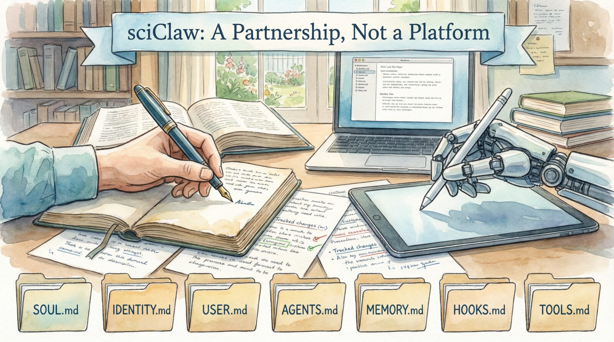

<div align="center">



<br />

**A paired-scientist agent for reproducible research workflows.**

[](https://go.dev)
[](https://github.com/drpedapati/sciclaw/releases)
[](LICENSE)

[Website](https://sciclaw.dev) ·
[Documentation](https://sciclaw.dev/docs.html) ·
[Manuscript (pending arXiv submission #7284050)](docs/assets/sciclaw-arxiv.pdf) ·
[YouTube Tutorial](https://www.youtube.com/watch?v=P3pDulPnCzU) ·
[Releases](https://github.com/drpedapati/sciclaw/releases) ·
[Discussions](https://github.com/drpedapati/sciclaw/discussions)

</div>

---

sciClaw is a paired-scientist agent for rigorous research work. It connects to major LLM providers, proposes and executes hypothesis-driven loops, runs real tools (literature, documents, shell), and keeps an auditable evidence trail in your workspace.

Built on the [PicoClaw](https://github.com/sipeed/picoclaw) runtime (a Go rewrite of [nanobot](https://github.com/HKUDS/nanobot)), sciClaw keeps a single-binary footprint while adding a paired-scientist operating model: plan, evidence, review, iterate.

## How You Talk to sciClaw

The most natural way to use sciClaw is through **Telegram** or **Discord**. You message it like you'd message a colleague. Ask a question, attach a file, get results back. No terminal, no special syntax.

```
You:      "Find recent papers on TDP-43 proteinopathy in ALS"
sciClaw:  [searches PubMed, returns 47 papers with citations, saves to workspace]

You:      "Draft a methods section using the attached protocol"
sciClaw:  [produces a Word doc with tracked changes you review in Microsoft Word]
```

New users should follow [Quick Start](#quick-start) below for the canonical setup path (install -> initialize -> authenticate -> connect chat).

> **Prefer a visual interface?** Run `sciclaw app` to open an interactive dashboard in your terminal — no CLI knowledge needed. A CLI is also available for power users: `sciclaw agent -m "your question"` or `sciclaw agent` for interactive mode.

## Install

### Homebrew (recommended)

```bash
brew tap drpedapati/tap && brew install sciclaw
```

### Homebrew (development channel)

```bash
brew tap drpedapati/tap && brew install sciclaw-dev
```

`sciclaw-dev` tracks development branch releases. If stable `sciclaw` is already installed, uninstall it first to avoid binary name collisions.

macOS only:
```bash
brew install --cask quarto
```

### Download a binary

Pre-compiled binaries for macOS (arm64), Linux (amd64, arm64, riscv64), and Windows (amd64/WSL) are on the [releases page](https://github.com/drpedapati/sciclaw/releases).

### From source

```bash
git clone https://github.com/drpedapati/sciclaw.git
cd sciclaw
make deps && make install
```

Homebrew pulls companion tools automatically (ImageMagick, IRL, ripgrep, docx-review, pubmed-cli). For binary/source installs, run `sciclaw doctor` for hints.

After any install method, initialize once:
```bash
# Recommended: interactive app with first-run setup wizard
sciclaw app

# CLI alternative (headless/non-TUI)
sciclaw onboard
```

## Quick Start

**1. Initialize** — choose one:

```bash
# Recommended: launches the app and starts first-run setup
sciclaw app

# CLI alternative (headless/non-TUI)
sciclaw onboard
```

**2. Authenticate** with your AI provider:

```bash
sciclaw auth login --provider openai     # OAuth device code — works with your ChatGPT account
sciclaw auth login --provider anthropic  # Token paste

# Optional: import from 1Password item JSON (requires OP_SERVICE_ACCOUNT_TOKEN)
export OP_SERVICE_ACCOUNT_TOKEN="ops_..."
sciclaw auth import-op --provider openai --item "OpenAI Credentials"
sciclaw auth import-op --provider anthropic --item "Anthropic Token" --vault "AI" --auth-method token
```

**3. Connect a chat app** and start messaging:

```bash
sciclaw channels setup telegram
sciclaw service install && sciclaw service start
```

See [Authentication docs](https://sciclaw.dev/docs.html#authentication) for all providers. See [Chat Channels](#chat-channels) below for Telegram and Discord setup details.

## Security

sciClaw's default posture is **local, private, and locked down**. Here's what that means in practice:

- **Runs on your machine.** sciClaw is a program on your computer, not a cloud service. There's no account to create with us, no server to connect to, nothing hosted anywhere.
- **Your data stays in one folder.** Everything sciClaw produces lives in `~/sciclaw` — a folder on your machine that you own and control. You can open it, back it up, or delete it anytime.
- **Nothing is exposed to the internet.** sciClaw doesn't open any ports or listen for incoming connections. It reaches out only when you send a message, and only to the AI provider you chose (OpenAI, Anthropic, etc.) and any tools you explicitly enable (like PubMed).
- **Messages go through your private bot.** When you chat via Telegram or Discord, messages travel through a bot that only you control. Nobody else can talk to it unless you explicitly allow them.
- **No telemetry, no analytics, no tracking.** sciClaw sends nothing back to us. No usage data, no error reports, no phone-home behavior. We don't know you're running it.
- **API keys stay local.** Your credentials are stored in a config file on your machine (`~/.picoclaw/config.json`). They're never transmitted to anyone except the provider they belong to.
- **Skills are validated before install.** Every skill goes through size limits, binary rejection, frontmatter validation, and SHA-256 provenance logging. Catalog fetches use pinned commit refs for supply-chain hardening.

For the full security model, see [Security](https://sciclaw.dev/security.html).

## Providers

sciClaw auto-detects the provider from the model name. Set credentials via the onboard wizard or `sciclaw auth login`.

| Provider | Models | Auth |
|----------|--------|------|
| **OpenAI** | gpt-5.2 (primary), gpt-5.2-chat-latest, gpt-5.2-pro | API key or device-code OAuth |
| **Anthropic** | claude-opus-4-6, claude-sonnet-4-5 | API key or token paste |
| **Gemini** | gemini-2.5-pro, gemini-2.5-flash | API key |
| **OpenRouter** | All models via `openrouter/` prefix | API key |
| **DeepSeek** | deepseek-chat, deepseek-reasoner | API key |
| **Groq** | Fast inference + Whisper voice transcription | API key |
| **Zhipu** | GLM models | API key |

> Groq provides free voice transcription via Whisper. When configured, Telegram voice messages are automatically transcribed.

## Built-in Skills

Fifteen skills are installed during `sciclaw onboard`:

### Research & Literature
- **scientific-writing** — Manuscript drafting with claim-evidence alignment
- **pubmed-cli** — PubMed search, article fetch, citation graphs, MeSH lookup ([CLI tool](https://github.com/drpedapati/pubmed-cli))
- **biorxiv-database** — bioRxiv/medRxiv preprint surveillance

### Authoring & Visualization
- **quarto-authoring** — Loop-driven `.qmd` authoring and rendering
- **pandoc-docx** — Clean `.docx` manuscript generation from Markdown with NIH template auto-apply
- **imagemagick** — Reproducible image preprocessing (resize, crop, convert, DPI normalization) via `magick`
- **beautiful-mermaid** — Publication-grade Mermaid diagrams
- **explainer-site** — Technical, single-page "How X Works" explainer site generation

### Evidence & Provenance
- **experiment-provenance** — Reproducible experiment metadata capture
- **benchmark-logging** — Benchmark records with acceptance criteria

### Office & Documents
- **docx-review** — Word tracked-change review, comments, semantic diff, and template population (`--create`, v1.3.0+) ([CLI tool](https://github.com/drpedapati/docx-review))
- For clean first-draft Word output, use `pandoc ... -o file.docx`; sciClaw injects `--defaults <generated-file>` at runtime to apply a bundled NIH reference template (no global `~/.pandoc/defaults.yaml` required).
- **pptx** — PowerPoint creation and editing
- **pdf** — PDF creation, merging, splitting, and extraction
- **xlsx** — Spreadsheet creation, analysis, and conversion

### Polish
- **humanize-text** — Final-pass language polishing for natural tone

### Optional
- **phi-cleaner** — Clinical text de-identification for PHI-safe sharing (`brew install drpedapati/tools/phi-cleaner`)

Additional skills: [skills catalog](https://github.com/drpedapati/sciclaw-skills) — install with `sciclaw skills install drpedapati/sciclaw-skills/<name>`

## Chat Channels

Telegram and Discord are the recommended way to interact with sciClaw. You message it from the app you already have open.
When the agent generates deliverables (for example `.docx`), it can now send real file attachments back through Discord/Telegram via the `message` tool.

<details>
<summary><strong>Telegram setup</strong> (easiest)</summary>

1. Open Telegram, search `@BotFather`, send `/newbot`, copy the token
2. Run `sciclaw channels setup telegram` (pairs your account and writes config)
3. Start the gateway: `sciclaw service install && sciclaw service start`

Manual config (advanced) in `~/.picoclaw/config.json`:

```json
{
  "channels": {
    "telegram": {
      "enabled": true,
      "token": "YOUR_BOT_TOKEN",
      "allow_from": ["YOUR_USER_ID"]
    }
  }
}
```

</details>

<details>
<summary><strong>Discord setup</strong></summary>

1. Create app at [discord.com/developers](https://discord.com/developers/applications)
2. Enable **MESSAGE CONTENT INTENT** in Bot settings
3. Copy bot token, get your User ID (Developer Mode → right-click → Copy User ID)
4. Run `sciclaw channels setup discord` or add to config manually
5. Generate invite URL (scopes: `bot`; permissions: Send Messages, Read Message History)
6. Start the gateway: `sciclaw service install && sciclaw service start`

</details>

**Background service** (recommended — keeps sciClaw running):
```bash
sciclaw service install    # register with launchd (macOS) or systemd (Linux)
sciclaw service start
sciclaw service status     # check it's running
```

Platform notes:
- **macOS**: per-user `launchd` (`~/Library/LaunchAgents/io.sciclaw.gateway.plist`)
- **Linux**: `systemd --user` (`~/.config/systemd/user/sciclaw-gateway.service`)
- **WSL**: service mode works when systemd is enabled; otherwise `sciclaw gateway` in a terminal

## Collaborative Routing (Channel -> Workspace)

Give each project its own chat room. Routing maps a Discord or Telegram channel to a specific data folder so the agent only sees that project's files — while still having access to your shared personality, skills, and memory from `~/sciclaw`.

**Mention to activate.** In routed channels the bot stays quiet unless someone `@mention`s it, so collaborators can talk freely without triggering responses. DMs always work without a mention.

Example:

```bash
sciclaw routing add \
  --channel discord \
  --chat-id 1467290563052048476 \
  --workspace /absolute/path/to/project-a \
  --allow 8535331528,1467290563052048476 \
  --label project-a

sciclaw routing enable
sciclaw routing validate
sciclaw routing reload
```

To let the bot respond to every message (no `@mention` needed), add `--no-mention`:

```bash
sciclaw routing add \
  --channel discord \
  --chat-id 1467290563052048476 \
  --workspace /absolute/path/to/project-a \
  --allow 8535331528 \
  --no-mention
```

Useful operations:
- `sciclaw routing status`
- `sciclaw routing list`
- `sciclaw routing explain --channel <channel> --chat-id <id> --sender <id> [--mention] [--dm]`
- `sciclaw routing set-users --channel <channel> --chat-id <id> --allow <id1,id2>`
- `sciclaw routing remove --channel <channel> --chat-id <id>`
- `sciclaw routing export --out routing.json` / `sciclaw routing import --in routing.json [--replace]`

Session isolation is namespaced as `<channel>:<chat_id>@<workspace_hash>` to prevent cross-workspace context bleed. Each routed workspace gets its own sessions, memory, and state, but inherits your personality files (`AGENTS.md`, `SOUL.md`, etc.) and skills from the shared workspace (`~/sciclaw`).

## IRL Integration

sciClaw integrates with [IRL](https://github.com/drpedapati/irl-template) (Idempotent Research Loop) for project lifecycle management. IRL is installed automatically as a Homebrew dependency.

The agent manages projects through natural conversation:

```bash
sciclaw agent -m "Create a new project for ERP correlation analysis"
sciclaw agent -m "What projects do I have?"
```

Every IRL command is recorded in `~/sciclaw/irl/commands/` for auditability.

## Workspace Layout

```
~/sciclaw/
├── sessions/          # Conversation history
├── memory/            # Long-term memory (MEMORY.md)
├── state/             # Persistent state
├── cron/              # Scheduled jobs
├── skills/            # Installed skills
├── hooks/             # Hook audit log (JSONL)
├── irl/commands/      # IRL command audit records
├── AGENTS.md          # Agent behavior guide
├── HOOKS.md           # Hook policy (plain-language)
├── IDENTITY.md        # sciClaw identity
├── SOUL.md            # Agent values & guardrails
├── TOOLS.md           # Tool descriptions
└── USER.md            # User preferences
```

## Docker

```bash
git clone https://github.com/drpedapati/sciclaw.git && cd sciclaw
cp config/config.example.json config/config.json   # edit with your credentials
docker compose --profile gateway up -d              # gateway mode
docker compose run --rm sciclaw-agent -m "Hello"    # one-shot
```

The Docker image is a full runtime and includes:
`python3`, `uv`, `ripgrep`, `imagemagick`, `pandoc`, `quarto`, `docx-review`, `pubmed-cli`, and `irl`.

## Troubleshooting

Run `sciclaw doctor` to diagnose issues — it checks config, auth, tools, skills, gateway, and service health.

```bash
sciclaw doctor            # human-readable report
sciclaw doctor --fix      # auto-fix common issues
```

<details>
<summary>Common issues</summary>

**"no credentials for openai/anthropic"**
```bash
sciclaw auth login --provider openai
```

**Telegram "Conflict: terminated by other getUpdates"** — only one gateway instance can run at a time:
```bash
sciclaw service restart
```

**Web search "API configuration problem"** — get a free key at [brave.com/search/api](https://brave.com/search/api) and add to config under `tools.web.search.api_key`.

</details>

## Updating

```bash
brew upgrade sciclaw     # update the binary
sciclaw onboard          # refresh skills to latest
sciclaw doctor           # verify everything
```

## sciClaw Fork Patch Changelog (Curated)

This is a curated, code-grounded changelog of sciClaw-specific patches on top of upstream PicoClaw.

Source of truth:
- `git log --oneline upstream/main..main`

Last refreshed:
- `2026-02-24`

### TUI Dashboard and `sciclaw app`

- `42f38bd` Rewrote TUI as interactive Go control center with Charmbracelet Bubbletea (12 tabs: Home, Chat, Channels, Routing, Users, Models, Skills, Schedule, Gateway, Settings, Login, Health).
- `e205dc5` Added first-run onboarding wizard (auth, smoke test, channel setup, service install) that triggers automatically on first launch.
- `f52b5ad` Completed routing and settings issue backlog in TUI.
- `b32ef47` Added pick-route-users from central list and label edits.
- `03f852d` Added endpoint-backed model catalog and TUI model picker.
- `d636a7e` Added routing wizard, folder browser, settings tab, and UX improvements.
- `764b000` Aliased `sciclaw app` as the primary command for the TUI dashboard (`tui` still works).

### Collaborative Routing

- `899a460` Added routing config schema and validation.
- `ae88a28` Added resolver, dispatcher, and agent-loop pool for channel→workspace routing.
- `c9cc447` Added routing CLI control-plane commands (`add`, `remove`, `list`, `status`, `explain`, `export`, `import`, `reload`).
- `dbb8bbf` Added runtime resolver hot-reload trigger (`sciclaw routing reload`).
- `a3d8668` Added routing diagnostics to `sciclaw doctor`.
- `01d77fd` Required `@mention` in routed channels by default; added auto-reload on mapping changes.
- `9f89f9a` Changed default unmapped-channel behavior from block to default-workspace fallback.
- `852d672` Added shared workspace policy with read-only guardrails for routed workspaces.

### Identity, Workspace, and Baseline Skilling

- `1028a75` Dual-binary rebrand (`sciclaw` primary, `picoclaw` alias) (`cmd/picoclaw/main.go`, `Makefile`).
- `116dba4` Rebranded CLI display surfaces while preserving picoclaw compatibility (`cmd/picoclaw/main.go`).
- `411ec69` Added git commit hash to runtime version output (`cmd/picoclaw/main.go`, `Makefile`).
- `d4b4d2f` Switched default workspace to visible `~/sciclaw` and updated migration behavior (`pkg/config/config.go`, `pkg/migrate/config.go`).
- `f7db953` Externalized workspace bootstrap templates via embed for predictable onboarding (`pkg/workspacetpl/templates.go`, `pkg/workspacetpl/templates/workspace/`).
- `d577877` Added baseline science-skill policy and auto-install on onboard (`cmd/picoclaw/main.go`, `pkg/workspacetpl/templates/workspace/AGENTS.md`).
- `70dc430` Replaced old `docx` / `pubmed-database` skills with CLI-powered `docx-review` / `pubmed-cli` flows (`skills/docx-review/SKILL.md`, `skills/pubmed-cli/SKILL.md`).
- `3f64ec6` Added baseline `pandoc-docx` skill for NIH-templated Word drafting (`skills/pandoc-docx/SKILL.md`, `cmd/picoclaw/main.go`).
- `c3f8f90` Added `explainer-site` as baseline onboard skill (`skills/explainer-site/SKILL.md`, `cmd/picoclaw/main.go`).
- `8c19e46` Added `imagemagick` as baseline skill plus runtime/packaging dependency checks (`skills/imagemagick/SKILL.md`, `cmd/picoclaw/doctor_cmd.go`, `deploy/update-tap.sh`).
- `c49ede1` Added optional `phi-cleaner` skill for PHI de-identification workflows (`skills/phi-cleaner/SKILL.md`, `README.md`).

### Providers, OAuth, and Cloudflare/NAT Resilience

- `349af96` Added `--model` and `--effort`, plus `sciclaw models` subcommands and reasoning-effort wiring (`cmd/picoclaw/main.go`, `pkg/models/models.go`).
- `fee0fc5` Changed default model lineage to GPT-5.2 (`pkg/models/models.go`, `config/config.example.json`).
- `2f0f059` Added Azure OpenAI endpoint/provider support (`pkg/providers/azure_provider.go`, `pkg/config/config.go`).
- `f9819bf` Made OpenAI auth login device-code-first and reduced browser-flow friction (`cmd/picoclaw/main.go`).
- `6d6d23c` Added OAuth retries and TLS tuning for VM/NAT stability (`pkg/auth/oauth.go`).
- `36511b2` Capped OAuth auth transport at TLS 1.2 during Cloudflare-reset mitigation (`pkg/auth/oauth.go`).
- `ad5970f` Added Chrome-like uTLS client fingerprinting for OAuth reliability behind restrictive networks (`pkg/auth/oauth.go`).
- `b19da1e` Added Cloudflare-focused transport path (uTLS + compression) for Codex/API access hard cases (`pkg/auth/oauth.go`, `pkg/providers/codex_provider.go`, `pkg/providers/http_provider.go`).
- `f4cb049` Restored TLS 1.2 floor and scoped custom transport to Cloudflare-only paths to avoid broader regression (`pkg/transport/transport.go`, `pkg/providers/http_provider.go`).

### Tool Execution, Guardrails, and Document Pipeline

- `2f57030` Hardened skill installer with size limits, text validation, and provenance checks (`pkg/skills/installer.go`, `pkg/skills/installer_test.go`).
- `65be47a` Enforced CLI-first workspace policy and reduced guard false positives (`cmd/picoclaw/tools_policy.go`, `pkg/tools/shell.go`).
- `39baacd` Fixed heredoc URL payload false positives in shell safety guard (`pkg/tools/shell.go`).
- `eeb3928` Allowed PubMed field-tag query forms through path guard (`pkg/tools/shell.go`).
- `7ef63f0` Relaxed path guard for safe temp outputs and `/dev/null` workflows (`pkg/tools/shell.go`).
- `6b7ad2e` Removed default hard task-iteration cap (`0 = unbounded`) for long scientific jobs (`pkg/agent/loop.go`, `pkg/tools/toolloop.go`).
- `155b861` Added automatic NIH template application for pandoc DOCX generation (`pkg/tools/shell.go`, `cmd/picoclaw/tools_policy.go`).
- `eb45a38` Decoupled NIH pandoc template from docx-review and aligned docs/policy (`pkg/tools/assets/nih-standard.docx`, `pkg/tools/shell.go`, `pkg/workspacetpl/templates/workspace/TOOLS.md`).
- `f7aeb98` Switched to `pandoc --defaults` injection for robust template application (`pkg/tools/shell.go`, `pkg/tools/shell_test.go`).

### Channels and Agent Output UX

- `cb566d5` Added first-class channel setup wizard for Telegram/Discord (`cmd/picoclaw/channels_cmd.go`).
- `1f313e2` Enforced Discord allowlist-first onboarding and confirmation before save (`cmd/picoclaw/channels_cmd.go`).
- `73711b2` Added Discord typing indicator support (`pkg/channels/discord.go`).
- `2ba9543` Added Discord long-response chunking and scientific export/count tools (`pkg/channels/discord.go`, `pkg/tools/pubmed_export.go`, `pkg/tools/word_count.go`).
- `87f8b67` Added message-tool attachment support over Discord/Telegram channels (`pkg/tools/message.go`, `pkg/channels/discord.go`, `pkg/channels/telegram.go`).
- `b800cac` Improved Telegram attachment routing and expanded adapter attachment tests (`pkg/channels/telegram.go`, `pkg/channels/telegram_test.go`).
- `d33e77e` Made onboard reruns idempotent and added docs-linked guidance (`cmd/picoclaw/main.go`).
- `b8c456a` Made onboard next-step messaging dynamic from real setup state (`cmd/picoclaw/main.go`).

### Service Lifecycle, Doctor, and Homebrew Delivery

- `4f1bf53` Introduced `sciclaw doctor` for deployment verification (`cmd/picoclaw/doctor_cmd.go`).
- `774fb96` Added doctor install hints for missing dependencies (`cmd/picoclaw/doctor_cmd.go`).
- `452aba0` Reduced false Telegram 409 conflict reports in doctor checks (`cmd/picoclaw/doctor_cmd.go`).
- `63ca0ef` Added service lifecycle command (`install/start/stop/restart/logs`) with launchd/systemd support (`cmd/picoclaw/service_cmd.go`, `pkg/service/`).
- `3b8eac2` Added `service refresh` and doctor stale executable-path auto-fix logic (`cmd/picoclaw/service_cmd.go`, `cmd/picoclaw/doctor_service_path_test.go`).
- `81e0073` Added Homebrew post-upgrade service auto-refresh with caveat fallback (`deploy/update-tap.sh`, `.github/workflows/release.yml`).
- `df478a6` Fixed systemd user service PATH handling for Homebrew-installed tools (`pkg/service/systemd_linux.go`, `pkg/service/path.go`).
- `7060db0` Bound service install to stable PATH-resolved binary to survive upgrades (`cmd/picoclaw/service_cmd.go`).
- `0310233` Bootstrapped Linux workspace Python environment with `uv` and service PATH wiring (`cmd/picoclaw/python_setup.go`, `cmd/picoclaw/service_cmd.go`).
- `b37030f` Added local release pipeline target for faster binary + tap publishing (`Makefile`, `deploy/update-tap.sh`).
- `a1192fc` Switched Homebrew formula generation to pre-compiled binary distribution path (`.github/workflows/release.yml`).

### Security and IRL Integration

- `61b15cd` Blocked symlink-based workspace escape paths in filesystem tooling (`pkg/tools/filesystem.go`, `pkg/tools/filesystem_test.go`).
- `ce7d05b` Tightened file permissions and enforced Slack ACL checks (`pkg/channels/slack.go`, `pkg/config/config.go`, `cmd/picoclaw/main.go`).
- `f19420b` Tightened config/channel state handling and disabled heartbeat default for safer baseline posture (`pkg/config/config.go`, `pkg/channels/base.go`).
- `4095251` Pinned skills catalog ref and hardened QQ dedup cache handling (`pkg/skills/installer.go`, `pkg/channels/qq.go`).
- `449ed15` Added external IRL adapter with command-store auditing (`pkg/irl/client.go`, `pkg/irl/store.go`).
- `d3b7078` Added internal `irl_project` tool for agent-mediated IRL workflows (`pkg/tools/irl_project.go`, `pkg/agent/loop.go`).
- `d691b11` Added cross-platform IRL binary fallback resolution (`pkg/irl/client.go`).
- `be9cd3d` Added IRL project-list fallback behavior when JSON/list commands fail (`pkg/irl/client.go`).
- `e6e8ff3` Made runtime IRL status detection independent of PATH assumptions (`cmd/picoclaw/main.go`, `pkg/irl/client.go`).

### Docs and Scientist UX Surfaces

- `65f032e` Overhauled landing page for non-technical academic/scientist audience (`docs/index.html`).
- `ed9ca89` Shifted docs/landing to messaging-first setup framing (`docs/index.html`).
- `6a8e442` Added dedicated security page and restructured README around messaging-first operations (`docs/security.html`, `README.md`).
- `af32c3d` Unified top navigation across docs surfaces for consistency (`docs/index.html`, `docs/docs.html`, `docs/philosophy.html`, `docs/biography.html`).

<details>
<summary>CLI reference</summary>

| Command | Description |
|---------|-------------|
| `sciclaw app` | Open the graphical dashboard (alias: `tui`) |
| `sciclaw onboard` | Initialize config, workspace, and baseline skills |
| `sciclaw agent -m "..."` | One-shot message |
| `sciclaw agent` | Interactive chat |
| `sciclaw agent --model <m>` | Override model |
| `sciclaw agent --effort <level>` | Set reasoning effort (`none` through `xhigh`) |
| `sciclaw models list` | Show current model and providers |
| `sciclaw models set <model>` | Change default model |
| `sciclaw models effort <level>` | Change default effort |
| `sciclaw status` | System status |
| `sciclaw doctor` | Verify deployment |
| `sciclaw doctor --fix` | Auto-fix common issues |
| `sciclaw gateway` | Start chat gateway |
| `sciclaw service install\|start\|stop\|restart\|logs\|uninstall` | Manage background service |
| `sciclaw channels setup <channel>` | Configure a chat channel |
| `sciclaw auth login\|logout\|status\|import-op` | Manage credentials |
| `sciclaw skills list\|install` | Manage skills |
| `sciclaw cron list\|add` | Manage scheduled jobs |

</details>

## License

MIT — see [LICENSE](LICENSE).

sciClaw is a fork of [PicoClaw](https://github.com/sipeed/picoclaw) by Sipeed, which is based on [nanobot](https://github.com/HKUDS/nanobot) by HKUDS.
