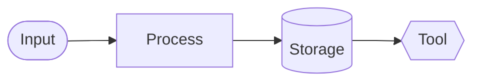
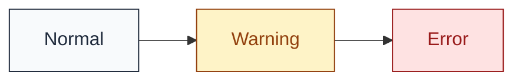
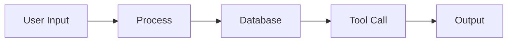
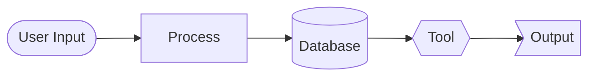

# Explainer Site Skill

Create deep-dive, single-page explainer websites in the style of [howkeyboardswork.com](https://howkeyboardswork.com) — technically rigorous but accessible, personal yet authoritative, with progressive disclosure from overview to implementation details.

> **Key Insight:** The magic is in three things: (1) personal voice that invites exploration, (2) pipeline thinking that shows the journey, and (3) **beautiful Mermaid diagrams** that explain visually what words struggle to convey.

## When to Use This Skill

Trigger phrases:
- "Create a 'How X Works' site"
- "Build an explainer page for..."
- "I want a deep-dive guide on..."
- "Make a site like howkeyboardswork.com but for..."
- "Educational single-page site about..."

## The Formula

This pattern works for any technical topic: keyboards, databases, compilers, HTTP, neural networks, coffee machines, refrigerators, etc. The magic is in the **combination of personal voice, progressive depth, and pipeline thinking**.

---

## Reference Examples

Study these implementations before building your own:

### Inspiration
- **[howkeyboardswork.com](https://howkeyboardswork.com)** — The gold standard. Personal voice, pipeline thinking, interactive toys, beautiful diagrams. Study the opening hook, the section rhythm, and how it balances accessibility with depth.

### Working Demo
- **[how-memory-works](https://github.com/henrybloomingdale/how-memory-works)** — A complete implementation of this skill pattern, explaining how AI memory systems work.
  - Stack: Nuxt 4 + TailwindCSS + beautiful-mermaid
  - Features: 4 interactive SVG toys (MemoryPipeline, ContextWindow, SearchSequence, HeartbeatState)
  - Design: Monochrome by default, substantial figure captions, prose-first
  - Clone it, run `npm install && npm run dev`, and explore the code

**Use the demo as a starting point.** Copy the project structure, component patterns, and diagram setup. Replace the content with your topic.

---

## Voice & Tone Guidelines

### The Opening Hook

Start with genuine personal curiosity. This establishes credibility through passion, not credentials.

**Pattern:**
```
I'm obsessed with [TOPIC] and the [ASPECT] we [USE/ENCOUNTER] every day without thinking twice about. 
We [ACTION] [FREQUENCY], yet most of us have no idea what actually happens [BEHIND THE SCENES DESCRIPTION]. 
I wanted to figure out how all of that worked — [LIST KEY COMPONENTS] — and decided to document what I learned on this site. 
It's been a way to deepen my own understanding and hopefully make it easier for others to appreciate the [QUALITY] behind something we all [USE/TAKE FOR GRANTED]. 
Let's go deep. [RELEVANT EMOJI]
```

**Example for databases:**
```
I'm obsessed with databases and the invisible infrastructure we rely on every day without thinking twice about. 
We query data billions of times a day, yet most of us have no idea what actually happens between typing SELECT and seeing results. 
I wanted to figure out how all of that worked — the parsing, the query planning, the storage engines, the whole stack — and decided to document what I learned on this site. 
It's been a way to deepen my own understanding and hopefully make it easier for others to appreciate the quiet engineering behind something we all depend on. 
Let's go deep. 🗄️
```

### Tone Principles

1. **First-person, conversational** — "I wanted to figure out", "Let's explore"
2. **Invitational, not lecturing** — "Let's go deep" not "This guide will teach you"
3. **Technical precision with plain language** — Define jargon on first use
4. **Genuine curiosity** — Share your "aha" moments
5. **Progressive confidence** — Start accessible, get technical
6. **Practical grounding** — Connect abstractions to real-world effects

### Sentence Style

- Short sentences for impact
- Longer sentences for explanation, then short for punch
- Use em-dashes for asides (in this style, they work)
- Parenthetical examples: "(e.g., Cherry MX Red)"
- Questions to transition: "But how does the controller know which key?"

---

## Content Structure

### 1. The Pipeline Overview

Every complex system is a **pipeline** — a chain of transformations from input to output. Start by showing the full journey, then zoom into each stage.

**Pattern:**
```markdown
## The [TOPIC] Pipeline
From [INPUT] to [OUTPUT] — the journey of a [UNIT]

When you [ACTION], it feels instantaneous. But between [START STATE] and [END STATE], 
an intricate chain of events unfolds in [TIMEFRAME].

This guide walks you through every step of that journey. We'll explore [COMPONENT 1], 
[COMPONENT 2], [COMPONENT 3], and finally [COMPONENT N].

Understanding this pipeline helps you appreciate why [INSIGHT 1], why [INSIGHT 2], 
and how [INSIGHT 3].

[OPTIONAL: Interactive visualization description]
The entire journey typically takes [TIME RANGE].
```

### 2. Section Template

Each section follows a consistent pattern:

```markdown
## [Component Name]
[One-line evocative description]

[Opening paragraph: What is this component? Why does it exist? Hook the reader.]

## [Subsection: Core Concept]
[Detailed explanation of the main idea]

## [Subsection: Variations/Types]
[Different implementations or categories]
- **Type A**: [Description] (e.g., [Example])
- **Type B**: [Description] (e.g., [Example])
- **Type C**: [Description] (e.g., [Example])

## [Subsection: The Problem This Solves]
[What would go wrong without this? Real consequences.]

## [Subsection: Real-World Considerations]
[How does this play out in practice? Trade-offs, tuning, edge cases.]

[OPTIONAL: Callout box for important aside]
[OPTIONAL: Source attribution for images/data]
```

### 3. Section Ordering

Sections should follow the **pipeline flow** — the natural order of data/events through the system:

1. **Physical/Input Layer** — Where the journey begins
2. **Conversion/Translation** — How raw input becomes structured
3. **Processing/Logic** — The core transformation
4. **Communication/Protocol** — How information moves between components
5. **Output/Delivery** — How results reach the end user
6. **Meta Concerns** — Latency, measurement, optimization

### 4. Practical Commands Section (Optional)

For systems/tools that users can configure, add a "Configuring the System" section with:

1. **File structure** — Show the workspace layout in a code block
2. **Commands table** — Natural language triggers and what they do
3. **Configuration examples** — Real config file snippets
4. **Quick reference table** — Summary of files/commands for scanning

```html
<div class="not-prose my-4">
  <table class="w-full text-sm border border-slate-200 rounded">
    <thead class="bg-slate-50">
      <tr>
        <th class="text-left p-3 border-b font-medium">Command</th>
        <th class="text-left p-3 border-b font-medium">What it does</th>
      </tr>
    </thead>
    <tbody>
      <tr class="border-b border-slate-100">
        <td class="p-3 font-mono text-xs">"Remember that..."</td>
        <td class="p-3">Writes to daily notes</td>
      </tr>
    </tbody>
  </table>
</div>
```

This section shifts from "how it works" to "how to use it" while maintaining the same voice.

### 5. The Closing

End with satisfaction and a soft call-to-action (if relevant):

```markdown
## And That's How [TOPIC] Work[s]!

From [START] through [MIDDLE COMPONENTS] to [END] — every [UNIT] is a small engineering marvel.

[OPTIONAL: Soft CTA to related product/project]
Now that you know the journey each [UNIT] takes, you might start wondering — [RELATED QUESTION]?

[Product/Tool Name] [DOES SOMETHING RELATED], turning [INVISIBLE THING] into [VISIBLE BENEFIT]. 
It's a [POSITIVE FRAMING] way to [BENEFIT].

[CTA Button Text]
```

---

## Technical Implementation

### Tech Stack

The reference implementation uses:
- **Nuxt 3** (Vue.js framework)
- **TailwindCSS** with `@tailwindcss/typography`
- **@nuxt/content** for markdown content
- **Static generation** (Cloudflare Pages/Workers)

### Project Structure

```
├── assets/css/           # Global styles (tailwind.css)
├── components/
│   ├── base/             # Reusable UI (Button, Card, etc.)
│   ├── content/          # Markdown components (Callout, etc.)
│   └── toys/             # Interactive demos/visualizations
├── content/guide/        # Markdown content files
│   ├── 00-intro.md
│   ├── 01-pipeline.md
│   ├── 02-component-a.md
│   ├── 03-component-b.md
│   └── ...
├── layouts/              # App layouts
├── pages/                # Route pages
│   └── index.vue         # Single-page that renders all sections
├── public/               # Static assets (images, og-image.jpg)
├── nuxt.config.ts        # Nuxt configuration
├── tailwind.config.ts    # Tailwind configuration
└── package.json
```

### Markdown Frontmatter

Each section is a markdown file with frontmatter:

```yaml
---
title: Section Title
description: Brief evocative description (shown as subtitle)
order: 2
slug: section-slug
---
```

Sections are automatically sorted by `order` and rendered sequentially on the homepage.

### Tailwind Typography Config

Use `@tailwindcss/typography` for beautiful prose styling:

```typescript
// tailwind.config.ts
export default {
  theme: {
    extend: {
      colors: {
        primary: {
          500: '#0ea5e9',  // Main accent
          600: '#0284c7',  // Links
          700: '#0369a1',  // Hover
        }
      },
      typography: {
        DEFAULT: {
          css: {
            maxWidth: 'none',
            color: '#374151',
            a: {
              color: '#0284c7',
              textDecoration: 'none',
              '&:hover': { textDecoration: 'underline' }
            },
            code: {
              backgroundColor: '#f3f4f6',
              padding: '0.25rem 0.375rem',
              borderRadius: '0.25rem',
              fontWeight: '400'
            }
          }
        }
      }
    }
  },
  plugins: [require('@tailwindcss/typography')]
}
```

### Custom Components

Create reusable content components for markdown:

**Callout Component** (`components/content/Callout.vue`):
```vue
<template>
  <div :class="['callout', `callout-${type}`]">
    <div class="callout-title">{{ title }}</div>
    <div class="callout-content">
      <slot />
    </div>
  </div>
</template>

<script setup>
defineProps({
  title: String,
  type: { type: String, default: 'info' }  // info, warning, tip
})
</script>
```

Usage in markdown:
```markdown
::Callout{title="Important Note" type="info"}
The actuation point is usually higher than the bottom-out point.
::
```

---

## Header Design (The Frosted Glass Pattern)

The header should be minimal, functional, and elegant. Study howkeyboardswork.com's header — it's a masterclass in restraint.

### The Complete Pattern

```html
<header class="sticky top-0 z-50 bg-white/80 backdrop-blur-sm border-b border-gray-200">
  <div class="max-w-6xl mx-auto px-4 py-4 flex items-center justify-between">
    <!-- Logo + Title (left) -->
    <a href="/" class="flex items-center gap-2 font-semibold text-lg text-gray-900 hover:text-sky-600 transition-colors">
      
      Site Title
    </a>
    
    <!-- Utility Link (right) -->
    <a href="https://github.com/..." 
       target="_blank" 
       rel="noopener noreferrer" 
       class="text-sm text-gray-600 hover:text-gray-900 transition-colors">
      View Source
    </a>
  </div>
</header>
```

### Key Techniques

| Element | Classes | Purpose |
|---------|---------|---------|
| Frosted glass | `bg-white/80 backdrop-blur-sm` | 80% white + blur = content visible but unreadable |
| Sticky behavior | `sticky top-0 z-50` | Stays on top during scroll |
| Subtle border | `border-b border-gray-200` | Definition without heaviness |
| Logo size | `h-8` (32px) | Visible but not dominating |
| Logo gap | `gap-2` (8px) | Breathing room between icon and text |
| Layout | `flex items-center justify-between` | Logo left, utility right |

### Vue Component

```vue
<template>
  <header class="sticky top-0 z-50 bg-white/80 backdrop-blur-sm border-b border-gray-200">
    <div class="max-w-6xl mx-auto px-4 py-4 flex items-center justify-between">
      <NuxtLink to="/" class="flex items-center gap-2 font-semibold text-lg text-gray-900 hover:text-sky-600 transition-colors">
        
        {{ title }}
      </NuxtLink>
      
      <a 
        v-if="sourceUrl"
        :href="sourceUrl" 
        target="_blank" 
        rel="noopener noreferrer" 
        class="text-sm text-gray-600 hover:text-gray-900 transition-colors"
      >
        View Source
      </a>
    </div>
  </header>
</template>

<script setup>
defineProps({
  title: { type: String, required: true },
  sourceUrl: { type: String, default: null }
})
</script>
```

### What NOT to Put in the Header

- **No navigation dropdowns** — Single-page explainer uses sidebar TOC
- **No social icons** — Footer, if anywhere
- **No search bar** — Cmd+F works for single-page sites
- **No heavy shadows** — Frosted glass + border is enough
- **No large logos** — `h-8` (32px) is plenty

### Dark Mode Variant

```html
<header class="sticky top-0 z-50 bg-slate-900/80 backdrop-blur-sm border-b border-slate-700">
  <!-- Same structure, different colors -->
</header>
```

---

## Beautiful Mermaid Diagrams (Critical!)

**Diagrams are not optional.** The reference sites use extensive visualizations to explain concepts. Use **beautiful-mermaid** (not plain mermaid) for professional, themed SVG output.

### Why beautiful-mermaid?

- 15 built-in themes (tokyo-night, nord, dracula, github-light, etc.)
- Simple two-color theming system
- Clean SVG output
- Works in browser via CDN

### Setup (CDN - Recommended for Nuxt/Vue)

Dynamic imports don't work reliably client-side. Use the CDN approach:

```typescript
// In your component's script setup
useHead({
  script: [
    {
      src: 'https://unpkg.com/beautiful-mermaid/dist/beautiful-mermaid.browser.global.js',
      defer: true
    }
  ]
})
```

### Rendering Diagrams

```typescript
// Define your diagrams
const diagrams = {
  pipeline: `graph LR
    A[Input] --> B[Process]
    B --> C[Output]`,
  // ... more diagrams
}

// Theme that matches your page design
const theme = {
  bg: '#f8fafc',      // Match page background
  fg: '#1e293b',      // Match text color
  accent: '#3b82f6',  // Your primary color
  muted: '#64748b',   // Secondary text
  surface: '#e2e8f0', // Node fills
  border: '#cbd5e1'   // Node borders
}

onMounted(() => {
  // Wait for CDN script to load
  const checkAndRender = () => {
    if (typeof window.beautifulMermaid !== 'undefined') {
      const { renderMermaid } = window.beautifulMermaid
      
      const renderDiagram = async (id, code) => {
        try {
          const svg = await renderMermaid(code, theme)
          const el = document.getElementById(id)
          if (el) el.innerHTML = svg
        } catch (e) {
          console.error(`Error rendering ${id}:`, e)
        }
      }
      
      // Render all diagrams
      renderDiagram('diagram-pipeline', diagrams.pipeline)
      // ... render others
    } else {
      setTimeout(checkAndRender, 100)  // Retry until loaded
    }
  }
  
  checkAndRender()
})
```

### HTML Structure

```html
<div class="not-prose my-10">
  <div id="diagram-pipeline" 
       class="diagram-container bg-slate-50 rounded-2xl p-8 border border-slate-200 flex justify-center min-h-[200px]">
  </div>
  <p class="text-center text-sm text-slate-500 mt-3">
    Fig 1: Description of diagram
  </p>
</div>
```

### Critical: Match Theme to Page Design!

**Don't use dark themes on light pages.** Create a custom theme that matches:

| Page Style | Theme Colors |
|------------|--------------|
| Light page | `bg: '#f8fafc'`, `fg: '#1e293b'` |
| Dark page | `bg: '#1a1b26'`, `fg: '#a9b1d6'` |

Or use built-in themes:
```typescript
import { THEMES } from 'beautiful-mermaid'
const theme = THEMES['github-light']  // For light pages
const theme = THEMES['tokyo-night']   // For dark pages
```
```

### Supported Diagram Types

| Type | Use Case | beautiful-mermaid Support |
|------|----------|---------------------------|
| `graph LR/TB` | Pipeline flows, architecture | ✅ Full |
| `sequenceDiagram` | Interactions, API flows | ✅ Full |
| `stateDiagram-v2` | State machines, lifecycle | ✅ Full |
| `classDiagram` | Object relationships | ✅ Full |
| `erDiagram` | Entity relationships | ✅ Full |
| `mindmap` | Concept hierarchies | ⚠️ Use `graph TD` as fallback |

### Diagram Syntax Tips

**Keep it simple.** Complex syntax causes errors. Avoid:
- Emoji in node labels (use plain text)
- Special characters in subgraph names
- Overly nested structures

**Good:**
```
graph LR
    A[User Message] --> B[Context Window]
    B --> C[Daily Notes]
```

**Problematic:**
```
graph LR
    subgraph Input["💬 Input"]  <!-- Emoji can break -->
        A[User Action]
    end
```

### Flowchart for Pipelines

```javascript
const pipeline = `graph LR
    A[Input] --> B[Process]
    B --> C[Transform]
    C --> D[Output]`
```

### Sequence Diagram for Interactions

```javascript
const sequence = `sequenceDiagram
    User->>App: Request
    App->>Server: API call
    Server-->>App: Response
    App->>User: Display`
```

### State Diagram for Lifecycles

```javascript
const state = `stateDiagram-v2
    [*] --> Idle
    Idle --> Active
    Active --> Complete
    Complete --> [*]`
```

### Figure Captions (Substantial!)

**Captions must be self-explanatory.** A reader should understand the diagram from the caption alone, without needing to read the surrounding text. This is academic-style figure captioning.

**Bad:** `Fig 1: The pipeline`
**Good:** `Fig 1. User messages enter the volatile context window, then get written to persistent daily notes and long-term memory files. Semantic search retrieves relevant context back into the window for future sessions.`

```html
<div class="not-prose my-6">
  <div id="diagram-name" 
       class="bg-white rounded border border-slate-200 p-4 min-h-[100px]">
  </div>
  <p class="text-center text-sm text-slate-600 mt-3 max-w-md mx-auto">
    <strong>Fig 1.</strong> Complete sentence explaining what this diagram shows, 
    including the key relationships and flow. The caption should communicate 
    the figure's meaning to someone who hasn't read the section text.
  </p>
</div>
```

**Caption formula:**
1. Start with `<strong>Fig N.</strong>`
2. Describe what the diagram depicts (nouns)
3. Explain the relationships/flow (verbs)
4. Include key insight if space allows

### Common Gotchas

1. **CDN script must load before rendering** — use the polling pattern shown above
2. **Theme must match page** — dark themes on light pages look terrible
3. **NO HTML in labels** — `<br>`, `<small>` will render as literal text. Use simple labels only.
4. **Use `not-prose` class** — prevents Tailwind Typography from breaking diagram styles
5. **Avoid dynamic imports** — they don't work reliably in browser; use CDN
6. **Test iteratively with browser** — use the browser tool to see actual rendering
7. **Reduce padding** — `p-4` not `p-10`; fat padding draws focus away from diagram
8. **Scale SVGs properly** — add CSS for `width: 100%` and appropriate `min-height`

### CSS for Proper Scaling

```css
/* Make diagrams fill container */
#diagram-pipeline :deep(svg) {
  width: 100%;
  height: auto;
  min-height: 80px;
}

#diagram-arch :deep(svg) {
  width: 100%;
  height: auto;
  min-height: 280px;
}
```

### Monochrome Diagrams (Default)

Keep diagrams black and white. Let shapes communicate meaning:



**Semantic shapes (no color needed):**
- `([text])` Stadium — terminals, start/end points
- `[text]` Rectangle — processes, steps
- `[(text)]` Cylinder — storage, databases
- `{{text}}` Hexagon — tools, utilities
- `>text]` Asymmetric — documents, outputs

### Color-Coded Nodes (Use Sparingly)

Only add color when it communicates specific meaning (e.g., error states, before/after comparison):



---

## Writing Each Section

### Opening Paragraph Formula

Every section needs a compelling opener that:
1. States what this component IS
2. Explains WHY it exists
3. Hints at what you'll learn

**Template:**
```
[COMPONENT] is [SIMPLE DEFINITION] — [FUNCTION/PURPOSE]. 
[WHY IT MATTERS or WHAT WOULD GO WRONG WITHOUT IT].
```

**Example:**
```
Every key on your keyboard sits atop a switch — a mechanism that converts 
your physical press into an electrical signal. The type of switch determines 
how your keyboard feels and sounds.
```

### Subsection Formula

For each subsection:

1. **Hook line** — What is this variant/aspect?
2. **How it works** — Technical explanation
3. **Trade-offs** — Pros/cons, when to use
4. **Example** — Concrete instance

### Technical Depth Ladder

Progress from accessible to advanced within each section:

1. **Level 1: Analogy/Overview** — "Think of it like..."
2. **Level 2: How it works** — The mechanism
3. **Level 3: Implementation details** — Specifics, numbers, protocols
4. **Level 4: Edge cases** — What can go wrong, advanced considerations

### Quantify Where Possible

Numbers make explanations concrete:
- "bounces for 1-5 milliseconds"
- "6 bytes per report"
- "125Hz polling rate (8ms intervals)"
- "The entire journey typically takes 5-25 milliseconds"

---

## Lists & Inline Elements

Prose isn't always the answer. Sometimes a list communicates faster — and sometimes inline styling makes the difference between scannable and sloggable.

### Lists vs Prose: When to Use Which

**Use bulleted lists when:**
- Items are parallel (same structure, comparable weight)
- Readers need to scan quickly
- Each item is short (one line, maybe two)
- You're showing options, features, or trade-offs

**Use prose when:**
- You're building an argument or narrative
- Items need context to make sense together
- The explanation requires transitions between ideas
- One item naturally leads to the next

**The 3-line rule:** If each bullet would need 3+ lines of explanation, consider prose with bold lead-ins instead. Lists with fat bullets feel like failed paragraphs.

### Bold Lead-In Pattern

The most useful list pattern for explainers. Each item starts with a bolded term or phrase, followed by an em-dash and the explanation:

```markdown
- **Facts** — Concrete information about the user (location, job, preferences they've stated)
- **Preferences** — Things they like, dislike, or have strong opinions about
- **Context** — Situational awareness (current project, recent events, mood)
- **Patterns** — Behaviors you've noticed over time
```

This pattern works because:
1. **Scannable** — Readers can skim bold terms to find what they need
2. **Self-labeling** — Each item names itself before explaining
3. **Consistent** — Parallel structure makes comparison easy
4. **Dense** — Packs information tightly without walls of text

**When to use:** Feature lists, component breakdowns, trade-off comparisons, glossary-style definitions, configuration options.

### Inline Code Styling

Use `inline code` for:
- File names and paths (`nuxt.config.ts`, `/content/guide/`)
- Commands and flags (`npm run dev`, `--host`)
- Variable names, function names, properties (`isRunning`, `onClick`)
- Specific values (`125Hz`, `8ms`, `#0ea5e9`)
- Technical terms on first use when precision matters

Tailwind Typography styles inline code with a subtle gray background (`#f3f4f6`), rounded corners, and slightly reduced font weight. This works well for most cases — no custom styling needed.

**Don't overuse it.** If every other word is in code font, the emphasis disappears. Reserve it for things that are literally code or precise technical values.

### Bold & Emphasis Patterns

**Bold (`<strong>` / `**text**`)** — Use for:
- Key terms on first introduction
- Important warnings or constraints
- Lead-ins for list items (see pattern above)
- Anything the reader absolutely must not miss

**Emphasis (`<em>` / `*text*`)** — Use for:
- Introducing a new concept name
- Stress in a sentence ("This is *not* optional")
- Titles of works (articles, papers)
- Tone/voice markers ("Think of it *this* way")

**The hierarchy:** Bold shouts. Emphasis nudges. Use bold sparingly or everything looks urgent. Use emphasis for natural speech rhythms.

### Complete Examples

**List within a section:**

```markdown
## Memory Types

The system maintains several memory layers, each with different persistence and purpose:

- **Volatile context** — The conversation window; cleared each session
- **Daily notes** — Timestamped logs written to `memory/YYYY-MM-DD.md`
- **Long-term memory** — Curated facts in `MEMORY.md`, reviewed periodically
- **Semantic index** — Vector embeddings for retrieval (optional)

Each layer serves a different timescale. Volatile context handles the current conversation. Daily notes capture what happened. Long-term memory distills what matters.
```

**Inline code in running text:**

```markdown
The polling rate determines how often the keyboard sends data — typically `125Hz` 
(every 8ms) for standard keyboards, up to `1000Hz` (every 1ms) for gaming peripherals. 
You can check your current rate with `usbhid-dump` on Linux or the manufacturer's 
software on Windows.
```

**Bold lead-in with prose follow-up:**

```markdown
The scanner maintains three modes:

- **Passive** — Waits for wake word; minimal CPU usage
- **Active** — Full speech recognition; higher accuracy, higher power draw
- **Burst** — Rapid capture mode for dictation; buffers locally before processing

Most users never leave Passive mode. The system switches to Active automatically 
when it detects the wake word, then drops back to Passive after 30 seconds of silence. 
Burst mode requires explicit activation — say "start dictation" to enable it.
```

### Formatting in HTML (When Needed)

For custom tables or layouts outside prose, use `not-prose` to escape Tailwind Typography styling:

```html
<div class="not-prose my-6">
  <ul class="space-y-2 text-sm">
    <li><strong>Input</strong> — Raw keypress signal</li>
    <li><strong>Debounce</strong> — Filter electrical noise</li>
    <li><strong>Matrix scan</strong> — Identify which key</li>
    <li><strong>USB HID</strong> — Package and transmit</li>
  </ul>
</div>
```

This gives you full control over spacing and styling when Typography's defaults don't fit.

---

## Prose Writing Patterns

This section digs deeper into the *craft* of writing explainer prose. The goal: every contributor produces text that feels like it came from the same curious, technically-rigorous voice.

### Paragraph Rhythm

Vary paragraph length intentionally. Monotonous blocks of same-sized paragraphs feel like a textbook. Rhythm creates energy.

**Opening paragraphs (2-3 sentences):** Hook + context. Pull the reader in, then ground them.

> The context window is where the magic happens — it's the AI's working memory. Everything it can "see" lives here: your message, the conversation history, any files it's referencing. And it's surprisingly small.

**Explanation paragraphs (3-5 sentences):** Build the concept. Layer details. Connect causes to effects.

> When you send a message, it gets tokenized and added to the context window alongside the existing conversation. The model processes this entire window at once, attending to every token to generate its response. Older messages don't get "forgotten" — they're still there, still influencing the output. But there's a hard limit. Once you exceed it (approximately 200,000 tokens for Claude), something has to go.

**Punchline paragraphs (1 sentence):** The key insight. Let it land.

> This is why long conversations eventually feel like the AI "forgot" what you discussed earlier — those tokens got evicted.

**The rhythm in practice:**
```
[Hook: 2 sentences]
[Build: 4 sentences]
[Punch: 1 sentence]

[Hook: 2 sentences]
[Build: 3 sentences]
[Punch: 1 sentence]
```

This pattern creates a breathing quality — expand, contract, expand, contract. Readers subconsciously feel the cadence.

### Transition Patterns

Transitions are the connective tissue. They guide readers between concepts without jarring jumps.

**Questions — spark curiosity, then answer:**
> But how does the model know which tokens to evict first?

> So what happens when the window fills up?

> But wait — if everything is in one window, how does it "remember" between sessions?

**Bridging — connect what we just learned to what's next:**
> This is where persistent memory comes in.

> That's the volatile layer. Now let's look at what survives.

> The context window handles the moment-to-moment. But conversations don't happen in isolation.

**Contrast — highlight the key insight by opposing it:**
> The key insight: it's not that the AI forgets — it's that it never had long-term memory to begin with.

> The surprise: context windows don't scroll. They don't summarize. They just... truncate.

> Most people assume AI "learns" from conversations. The reality: each session starts from zero.

**Progression — signal movement through the pipeline:**
> Now let's zoom into the memory layer.

> With the context window understood, we can examine what happens at the edges.

> From volatile to persistent — here's where the architecture gets interesting.

**Mix them.** Don't use the same transition type twice in a row.

### Analogies and Metaphors

Abstract concepts need concrete anchors. Analogies make the unfamiliar familiar.

**Pattern: "Think of X like Y"**
> Think of the context window like RAM in a computer — fast, essential, but temporary.

> Think of daily notes like a journal: everything gets written down, but you don't memorize every page.

**Pattern: "It's like [familiar experience]"**
> It's like a desk that can only hold so many papers. To add a new one, you have to remove one that's there.

> It's like a conversation at a party — you can follow along, but you won't remember every word tomorrow.

**Pattern: "Imagine [scenario]"**
> Imagine a librarian with perfect recall but no notebook. She can answer any question from books she's read, but forgets what you asked her yesterday.

> Imagine a whiteboard that auto-erases when full. The newest content overwrites the oldest.

**Rules for good analogies:**

1. **One analogy per concept** — mixing metaphors confuses
2. **Keep the mapping tight** — if the analogy breaks down in obvious ways, it hurts more than helps
3. **Use everyday objects** — desks, whiteboards, libraries, conversations
4. **Acknowledge limits** — "The analogy breaks down here, because unlike RAM..."

**From the memory explainer:**

> The context window is like a whiteboard — everything visible, everything usable, but finite. When you run out of space, the oldest content gets erased to make room for new.

> Daily notes work like a ship's log: chronological, exhaustive, but not meant for quick retrieval. You'd search it, not memorize it.

### Technical Depth Signaling

Show readers when you're getting specific. This builds trust and lets skimmers know what's optional.

**Inline `<code>` — for exact values, file names, commands:**
> The workspace lives in `~/clawd/`, with daily notes in `memory/YYYY-MM-DD.md`.

> Run `npm run generate` to build the static site.

> Claude's context window caps at approximately `200,000 tokens`.

Use inline code when:
- It's a file path, command, or variable
- It's an exact value someone might copy
- It distinguishes technical terms from prose

**Code blocks — for structure, examples, or anything multi-line:**

```markdown
```
~/clawd/
├── AGENTS.md       # Core behavior rules
├── MEMORY.md       # Long-term curated memory
├── TOOLS.md        # Local configuration
└── memory/
    └── YYYY-MM-DD.md  # Daily session notes
```
```

Use code blocks when:
- Showing file structure
- Displaying configuration examples
- Presenting multi-step commands
- Illustrating code snippets

**Parenthetical specifics — for precision without derailing flow:**
> The model can handle long conversations (approximately 200,000 tokens, or roughly 150,000 words).

> Messages are chunked before embedding (typically 512-1024 tokens per chunk).

> The retrieval step adds latency (usually 50-200ms depending on index size).

Parentheticals work for:
- Numbers that add precision
- Units and measurements
- Alternative framings ("or roughly...")
- Caveats ("depending on...")

**Callouts for deeper dives:**

::Callout{title="Token Math" type="info"}
One token ≈ 4 characters in English. A 200K context window holds roughly 150K words — about 2-3 novels. But don't let that fool you: structured data like JSON is far less token-efficient than prose.
::

Use callouts when:
- The detail is interesting but tangential
- It's "nice to know" not "need to know"
- Skimmers should be able to skip it

### Concrete Examples: The Patterns in Action

Here's how these patterns combine in real sections from an AI memory explainer:

---

**Example 1: Opening with hook + rhythm + analogy**

> Every message you send to an AI gets dropped into a single, finite space: the context window. This is where the model does all its thinking. (2 sentences — hook)
>
> Think of it like a whiteboard. Everything visible, everything usable, but strictly limited in size. When you fill it up, old content gets erased to make room for new. The model doesn't choose what to keep — it's pure chronology: oldest out, newest in. (4 sentences — build)
>
> This is why long conversations feel like the AI "forgot" earlier context — those tokens are gone. (1 sentence — punch)

---

**Example 2: Transition → technical depth → parenthetical**

> But how does the system decide what's worth keeping? (question transition)
>
> This is where `MEMORY.md` comes in — a curated file the agent reads at the start of every session. Unlike daily notes (which are exhaustive and chronological), this file holds distilled insights: lessons learned, preferences, key facts. Think of it as the difference between a ship's log and a captain's standing orders. (bridging + analogy)
>
> The file lives in your workspace root (`~/clawd/MEMORY.md`) and typically stays under 50KB to keep context usage reasonable. (parenthetical specifics)

---

**Example 3: Progression + contrast + punchline**

> With volatile memory understood, let's look at what persists. (progression)
>
> Most people assume AI "learns" from every conversation — that insights accumulate automatically. The reality is different: each session starts fresh. The model has no hidden memory bank. No background process consolidating what it learned. (contrast)
>
> If you want something remembered, you have to write it down. (punch)

---

**Example 4: Code block + parenthetical + transition**

> The workspace follows a simple structure:
>
> ```
> ~/clawd/
> ├── AGENTS.md          # Core behavior rules
> ├── MEMORY.md          # Long-term memory (read at session start)
> ├── TOOLS.md           # Local config and preferences
> └── memory/
>     └── YYYY-MM-DD.md  # Daily notes (one per day)
> ```
>
> Daily notes capture everything raw (approximately 2-10KB per active day), while `MEMORY.md` holds the distilled lessons (typically 10-50KB total). The agent reads today's notes plus yesterday's for continuity.
>
> Now let's look at how information flows between these layers. (progression)

---

### Before/After: Full Section Transformations

These examples show the complete transformation from shallow to explanatory prose.

**Example 1: Opening Hook**

❌ **Before (marketing voice):**
> ## How IRL Works
> IRL is a revolutionary platform that leverages cutting-edge AI to transform how you interact with the physical world.

✅ **After (explainer voice):**
> I've been obsessed with the gap between digital assistants and the real world. We talk to our phones all day, but they can't actually *do* anything physical. I wanted to understand what it would take to bridge that gap—sensors, actuators, the whole stack—and decided to document what I learned on this site. Let's go deep. 🔧

**The formula:**
1. Start with genuine curiosity ("I'm obsessed with...")
2. State the problem you wanted to solve
3. Explain why you documented it
4. Invite the reader along ("Let's go deep")

---

**Example 2: Section Depth**

❌ **Before (skeleton):**
> ## Playback
>
> The player receives HLS segments from the CDN. It uses adaptive bitrate to select quality based on connection speed. Segments are buffered before playback to handle network jitter. The player also handles seeking and quality switching.

✅ **After (full explanation):**
> ## Playback
> *The final mile — from CDN to your eyeballs*
>
> This is where all that backend engineering becomes real. The player running in your browser or app takes those HLS segments and turns them back into moving pictures. It sounds simple — just play the video files in order — but the player is doing constant, invisible work to keep your experience smooth.
>
> **Adaptive Bitrate (ABR)** is the player's secret weapon. Instead of picking one quality level and hoping for the best, the player continuously monitors your network conditions and switches quality on the fly. Buffering? Drop to 480p. Connection improved? Climb back to 1080p. All of this happens in the gaps between segments, so you never notice the switch.
>
> But how does the player know which quality to pick? There are several algorithms:
>
> - **Throughput-based** — Measures recent download speeds, picks the highest quality that fits. Simple but reactive.
> - **Buffer-based** — Watches how full the playback buffer is. Low buffer? Be conservative. Smoother but slower to adapt.
> - **Hybrid/ML-based** — Combines signals with machine learning to predict future conditions. Better results, much more complex.
>
> The buffer itself is a carefully tuned trade-off. Bigger buffers mean more resilience to network hiccups, but also more latency. Live streaming players typically maintain 2-4 seconds of buffer, while VOD players might buffer 30 seconds or more.
>
> The best players make all of this invisible. You just see video, smooth and responsive. But now you know: every stream you watch is a small miracle of real-time engineering.

**Word count comparison:**
- Before: ~45 words
- After: ~280 words

This isn't padding — it's actually *explaining* the concept.

---

**Example 3: Paragraph Rhythm**

❌ **Before (monotonous):**
> The ingest server receives the stream. It connects via RTMP protocol. The server validates the stream key and begins buffering frames. Once validated, frames are forwarded to the transcoding pipeline.

✅ **After (rhythmic):**
> The ingest server is your stream's first stop — a beefy machine sitting in a datacenter, waiting for your video to arrive. This is where the journey from your camera to the world actually begins. (2 sentences — hook)
>
> When you click "Go Live," your encoder opens an RTMP connection to the nearest ingest point. The server validates your stream key against the database, then starts buffering incoming frames into memory. It doesn't process the video itself — that's the transcoder's job — but it does check for basic sanity: is the bitrate reasonable? Are the timestamps monotonic? Is the audio synced? If something's wrong at this stage, you'll see it immediately in your streaming software. (5 sentences — build)
>
> The ingest is essentially a bouncer: it decides if your stream is allowed in. (1 sentence — punch)

---

### Voice Consistency Checklist

Before publishing, verify:

- [ ] **First person, invitational** — "I wanted to understand" not "This document explains"
- [ ] **Questions as transitions** — At least one per major section
- [ ] **Paragraph rhythm varies** — Mix of 1-sentence punches and 3-5 sentence builds
- [ ] **One analogy per concept** — Not zero, not three
- [ ] **Technical terms defined on first use** — Or linked to definition
- [ ] **Numbers are specific** — "200,000 tokens" not "lots of tokens"
- [ ] **Parentheticals add precision** — "(approximately X)" or "(usually Y-Z)"
- [ ] **Code inline for exact values** — Paths, commands, numbers
- [ ] **Code blocks for structure** — File trees, multi-line examples
- [ ] **Callouts for tangents** — Interesting but skippable depth

---

## Interactive Toys (On Request)

**Default to beautiful-mermaid for diagrams.** Only build interactive SVG components when specifically requested or when the concept truly benefits from animation/interaction.

### When to Use Interactive Components

- User explicitly asks for interactive/animated diagrams
- The concept involves a **process flow** that benefits from step-by-step animation
- There's a **feedback loop** or cycle that's hard to show statically
- User wants a "wow" factor for presentations

### The Pattern (from howkeyboardswork.com)

Interactive "toys" use Vue Composition API + SVG:

```vue
<script setup lang="ts">
import { ref, computed } from 'vue'

// 1. Define stages
const stages = [
  { id: 'input', label: 'Input', description: 'Data enters the system.' },
  { id: 'process', label: 'Process', description: 'Transformation happens.' },
  { id: 'output', label: 'Output', description: 'Result is produced.' },
] as const

// 2. State
const currentStage = ref(-1)
const isRunning = ref(false)
const pathProgress = ref<Record<string, number>>({
  'input-to-process': 0,
  'process-to-output': 0,
})

// 3. Helpers
function isStageActive(id: string): boolean {
  const idx = stages.findIndex(s => s.id === id)
  return currentStage.value >= idx
}

// 4. Path animation
async function animatePath(pathId: string, duration: number) {
  const steps = 20
  for (let i = 0; i <= steps; i++) {
    pathProgress.value[pathId] = i / steps
    await new Promise(r => setTimeout(r, duration / steps))
  }
}

// 5. Run sequence
async function run() {
  if (isRunning.value) return
  isRunning.value = true
  // Reset state, then step through stages with delays
  currentStage.value = 0
  await new Promise(r => setTimeout(r, 500))
  await animatePath('input-to-process', 400)
  currentStage.value = 1
  // ... continue for each stage
  isRunning.value = false
}
</script>

<template>
  <div>
    <button @click="run" :disabled="isRunning">Start</button>
    <svg viewBox="0 0 400 100">
      <!-- Nodes with reactive fills -->
      <rect :fill="isStageActive('input') ? '#1e293b' : '#f1f5f9'" ... />
      
      <!-- Animated paths using stroke-dasharray -->
      <line stroke="#e2e8f0" ... />
      <line stroke="#1e293b" 
        :stroke-dasharray="30"
        :stroke-dashoffset="30 - (pathProgress['input-to-process'] * 30)" />
    </svg>
  </div>
</template>
```

### Key Techniques

1. **stroke-dasharray/dashoffset** — Animate path "drawing" by adjusting offset
2. **Reactive fills** — `:fill="isStageActive(id) ? active : inactive"`
3. **Async stepping** — `await new Promise(r => setTimeout(r, ms))` between stages
4. **Progress cards** — Grid of cards showing stage descriptions as they activate

### File Structure

```
app/
├── components/
│   └── toys/
│       └── MemoryPipeline.vue   # Interactive component
└── app.vue                       # Import and use: <MemoryPipeline />
```

### Design Rules for Interactive Toys

- **Monochrome** — Black/white fills, no gratuitous color
- **Semantic shapes** — Stadium for terminals, cylinders for storage, hexagons for tools
- **Minimal controls** — Just "Start" button, optional "Reset"
- **Progress feedback** — Cards or labels showing current stage
- **Responsive SVG** — Use `viewBox` for scaling

---

## Design Principles

### Monochrome by Default

**Black and white first. Color sparingly, only for emphasis.** This is tried-and-true design discipline.

- Diagrams should render in monochrome by default
- Remove `classDef` color definitions unless you have a specific reason
- Use color only when it communicates meaning (e.g., error states, status)
- Let shape and structure do the heavy lifting

### Visual Hierarchy

1. **Section titles** — Large, clear, consistent
2. **Subsection headers** — Slightly smaller, still scannable
3. **Body text** — Readable, comfortable line length
4. **Code/technical** — Monospace, subtle background
5. **Callouts** — Distinct but not jarring

### Color Palette

Keep it minimal:
- **Primary accent**: One color for links, highlights (sky blue #0ea5e9)
- **Text**: Dark gray (#374151), not pure black
- **Background**: White or very light gray
- **Diagrams**: Black and white by default

### Code Blocks (High Contrast!)

**Use dark background with light text for code blocks.** Light backgrounds with default text have poor contrast.

```html
<!-- Good: dark bg, light text -->
<pre class="bg-slate-900 text-slate-100 border border-slate-700 rounded p-4 text-sm overflow-x-auto">
  <code>your code here</code>
</pre>

<!-- Bad: light bg, no explicit text color -->
<pre class="bg-slate-50 rounded p-4">  <!-- contrast issues! -->
```

For inline code within prose, Tailwind Typography handles it, but verify contrast visually.

### Tables Styling

**Tables need special treatment to escape Tailwind Typography's prose defaults.** The `@tailwindcss/typography` plugin applies opinionated styles that often conflict with clean data tables.

#### When to Use Tables vs Lists

| Use Tables | Use Lists |
|------------|-----------|
| Comparing attributes across items | Sequential steps or procedures |
| Two or more columns of related data | Hierarchical information |
| Quick-reference lookups | Single-column enumerations |
| Command/parameter documentation | Prose-heavy explanations |

**Rule of thumb:** If a reader needs to scan horizontally to compare values, use a table. If they're reading vertically through items, use a list.

#### The HTML Pattern

Tables inside `prose` containers get unwanted Typography styles. Escape with `not-prose`:

```html
<div class="not-prose my-4">
  <table class="w-full text-sm border border-slate-200 rounded">
    <thead class="bg-slate-50">
      <tr>
        <th class="text-left p-3 border-b border-slate-200 font-medium">Column A</th>
        <th class="text-left p-3 border-b border-slate-200 font-medium">Column B</th>
      </tr>
    </thead>
    <tbody>
      <tr class="border-b border-slate-100">
        <td class="p-3">Value</td>
        <td class="p-3">Description</td>
      </tr>
    </tbody>
  </table>
</div>
```

#### Class Breakdown

| Element | Classes | Purpose |
|---------|---------|---------|
| Wrapper `div` | `not-prose my-4` | Escape Typography, add vertical spacing |
| `table` | `w-full text-sm border border-slate-200 rounded` | Full width, smaller text, subtle border |
| `thead` | `bg-slate-50` | Light header background for contrast |
| `th` | `text-left p-3 border-b border-slate-200 font-medium` | Left-align, padding, bottom border, medium weight |
| `tbody tr` | `border-b border-slate-100` | Subtle row separators |
| `td` | `p-3` | Consistent cell padding |
| `td` (code) | `p-3 font-mono text-xs` | Monospace for commands/code values |

#### Two-Column Tables (Command/Description)

Best for documenting commands, parameters, or key-value pairs:

```html
<div class="not-prose my-4">
  <table class="w-full text-sm border border-slate-200 rounded">
    <thead class="bg-slate-50">
      <tr>
        <th class="text-left p-3 border-b border-slate-200 font-medium">Command</th>
        <th class="text-left p-3 border-b border-slate-200 font-medium">What it does</th>
      </tr>
    </thead>
    <tbody>
      <tr class="border-b border-slate-100">
        <td class="p-3 font-mono text-xs">"Remember that..."</td>
        <td class="p-3">Writes to daily notes</td>
      </tr>
      <tr class="border-b border-slate-100">
        <td class="p-3 font-mono text-xs">"Check my calendar"</td>
        <td class="p-3">Fetches upcoming events</td>
      </tr>
      <tr class="border-b border-slate-100">
        <td class="p-3 font-mono text-xs">"Search for..."</td>
        <td class="p-3">Queries web or local files</td>
      </tr>
    </tbody>
  </table>
</div>
```

#### Three-Column Tables (Quick Reference)

Best for file structures, API endpoints, or feature matrices:

```html
<div class="not-prose my-4">
  <table class="w-full text-sm border border-slate-200 rounded">
    <thead class="bg-slate-50">
      <tr>
        <th class="text-left p-3 border-b border-slate-200 font-medium">File</th>
        <th class="text-left p-3 border-b border-slate-200 font-medium">Purpose</th>
        <th class="text-left p-3 border-b border-slate-200 font-medium">When to use</th>
      </tr>
    </thead>
    <tbody>
      <tr class="border-b border-slate-100">
        <td class="p-3 font-mono text-xs">MEMORY.md</td>
        <td class="p-3">Long-term curated memory</td>
        <td class="p-3">Store lessons, preferences, key facts</td>
      </tr>
      <tr class="border-b border-slate-100">
        <td class="p-3 font-mono text-xs">memory/YYYY-MM-DD.md</td>
        <td class="p-3">Daily session notes</td>
        <td class="p-3">Log conversations, decisions, context</td>
      </tr>
      <tr class="border-b border-slate-100">
        <td class="p-3 font-mono text-xs">TOOLS.md</td>
        <td class="p-3">Local tool configuration</td>
        <td class="p-3">Device names, SSH hosts, preferences</td>
      </tr>
    </tbody>
  </table>
</div>
```

#### Complete Code Example

Here's a full section with both table patterns:

```html
<section class="prose prose-slate max-w-none">
  <h2>Configuring the System</h2>
  <p>The workspace uses several key files for configuration and memory.</p>
  
  <!-- Three-column quick reference -->
  <h3>File Structure</h3>
  <div class="not-prose my-4">
    <table class="w-full text-sm border border-slate-200 rounded">
      <thead class="bg-slate-50">
        <tr>
          <th class="text-left p-3 border-b border-slate-200 font-medium">File</th>
          <th class="text-left p-3 border-b border-slate-200 font-medium">Purpose</th>
          <th class="text-left p-3 border-b border-slate-200 font-medium">When to use</th>
        </tr>
      </thead>
      <tbody>
        <tr class="border-b border-slate-100">
          <td class="p-3 font-mono text-xs">AGENTS.md</td>
          <td class="p-3">Core behavior rules</td>
          <td class="p-3">Modify agent personality or workflow</td>
        </tr>
        <tr class="border-b border-slate-100">
          <td class="p-3 font-mono text-xs">MEMORY.md</td>
          <td class="p-3">Long-term memory</td>
          <td class="p-3">Store important facts and lessons</td>
        </tr>
        <tr class="border-b border-slate-100">
          <td class="p-3 font-mono text-xs">TOOLS.md</td>
          <td class="p-3">Local configuration</td>
          <td class="p-3">Device names, credentials, preferences</td>
        </tr>
      </tbody>
    </table>
  </div>
  
  <!-- Two-column command reference -->
  <h3>Natural Language Commands</h3>
  <p>These phrases trigger specific behaviors:</p>
  <div class="not-prose my-4">
    <table class="w-full text-sm border border-slate-200 rounded">
      <thead class="bg-slate-50">
        <tr>
          <th class="text-left p-3 border-b border-slate-200 font-medium">Command</th>
          <th class="text-left p-3 border-b border-slate-200 font-medium">What it does</th>
        </tr>
      </thead>
      <tbody>
        <tr class="border-b border-slate-100">
          <td class="p-3 font-mono text-xs">"Remember that..."</td>
          <td class="p-3">Writes to daily notes or MEMORY.md</td>
        </tr>
        <tr class="border-b border-slate-100">
          <td class="p-3 font-mono text-xs">"Check my calendar"</td>
          <td class="p-3">Fetches events from connected calendar</td>
        </tr>
        <tr class="border-b border-slate-100">
          <td class="p-3 font-mono text-xs">"Send an email to..."</td>
          <td class="p-3">Drafts and sends via configured email</td>
        </tr>
        <tr class="border-b border-slate-100">
          <td class="p-3 font-mono text-xs">"What did we discuss..."</td>
          <td class="p-3">Searches memory files for context</td>
        </tr>
      </tbody>
    </table>
  </div>
</section>
```

#### Common Gotchas

1. **Always use `not-prose`** — Without it, Typography adds unwanted margins and colors
2. **Match your page's color scheme** — Use `slate-200`/`slate-100` for light pages, darker variants for dark pages
3. **Keep `font-mono text-xs` for code cells** — Distinguishes commands from descriptions
4. **Remove the last row's `border-b`** — Optional, but cleaner: use `last:border-b-0` on `tr` if you prefer
5. **Don't forget `rounded` on the table** — Matches the overall design aesthetic

### Interactive Elements

Where concepts benefit from visualization:
- **Animations** for processes (signal flow, state changes)
- **Hover states** for detailed info
- **Live demos** for hands-on understanding

Keep interactives **optional enhancements** — the text should stand alone.

### Responsive Design

- Content-first, single column on mobile
- Generous margins on desktop
- Images scale gracefully
- Code blocks scroll horizontally on mobile

---

## Common Mistakes (What NOT to Do)

These patterns consistently undermine explainer sites. Recognizing them is half the battle.

### The Marketing Trap

**The core problem:** You built something cool and wanted to show it off—but "showing off" and "teaching" require fundamentally different approaches.

| Marketing Page | Explainer Page |
|----------------|----------------|
| "Look at this cool thing!" | "Let me teach you how this works" |
| Shallow, visual, persuasive | Deep, educational, curious |
| Hero sections, CTAs, social proof | Pipeline diagrams, prose, examples |
| Optimized for conversion | Optimized for understanding |
| 3-second attention span | 10-minute reading session |
| "Sign up now!" | "Let's go deep 🔬" |

**Visual symptoms of marketing trap:**

- **Gradient backgrounds** — screams "product launch," not "educational resource"
- **Card shadows and hover effects** — decorative, not functional
- **Decorative blobs/shapes** — draws eye away from text
- **Multiple accent colors** — forces readers to decode a color system
- **Animated background elements** — competes with content for attention
- **Large hero sections** — delays access to actual content
- **Sections that could be tweets** — no depth, no explanation

**What to do instead:** Think of an explainer site as a **well-typeset book**, not a **product landing page**. Books have continuous prose that flows, chapter/section hierarchy via headers, occasional figures and asides, generous margins, and consistent typography throughout.

### Typography Anti-Patterns

**❌ Decorative display fonts for headings:**

```css
/* WRONG: Font-family based hierarchy */
h1, h2, h3 {
  font-family: 'Fraunces', serif;  /* Decorative serif */
}

p, li {
  font-family: 'Inter', sans-serif;
}
```

This creates visual whiplash. Every heading forces a genre shift. Fraunces reads as "artisanal blog" or "lifestyle brand," not "technical documentation."

**✅ Size and weight hierarchy instead:**

```css
/* CORRECT: Single font family, size/weight hierarchy */
body {
  font-family: system-ui, sans-serif;
}

h1 { font-size: 2.25rem; font-weight: 700; }  /* 36px, bold */
h2 { font-size: 1.5rem; font-weight: 600; }   /* 24px, semibold */
h3 { font-size: 1.25rem; font-weight: 600; }  /* 20px, semibold */
p  { font-size: 1rem; font-weight: 400; }     /* 16px, regular */
```

**Other typography mistakes:**
- **Tight letter-spacing on body text** — reduces readability
- **Three or more font families** — cognitive noise
- **Geometric sans with low x-height** (Futura, Avant Garde) — hard to read in prose
- **Script or handwriting fonts** — never for technical content

### Diagram Anti-Patterns

**❌ All rectangles (no semantic differentiation):**



**✅ Semantic shapes that communicate meaning:**



**Other diagram mistakes:**
- **Random colors without meaning** — color should communicate (error states, before/after), not decorate
- **Minimal or missing captions** — "Fig 1: The pipeline" tells readers nothing
- **Fat padding** (`p-10`) — draws focus away from diagram content
- **No diagrams at all** — if you're explaining something with components or flow, visualize it
- **Dark themes on light pages** — jarring visual disconnect

### Prose Anti-Patterns

**❌ Bullet points instead of paragraphs:**

> ## Sensors
> - IRL uses advanced sensors
> - Sensors understand your environment
> - Three types of sensors are used
> - Data is processed in real-time

This is an outline, not an explanation. No room for nuance, examples, or building understanding.

**✅ Flowing prose with depth:**

> ## Sensors
> Every interaction between AI and the physical world starts with sensing—converting real-world phenomena into data the system can process.
>
> IRL uses three types of sensors: cameras for visual input, microphones for audio, and IMUs (inertial measurement units) for motion and orientation. Each sensor type has its own pipeline for converting raw signals into structured data. A camera captures 30 frames per second, but the vision model only processes keyframes—typically 1-3 per second—to balance latency and compute cost.
>
> The interesting challenge isn't collecting data—modern sensors are cheap and plentiful. It's *filtering* the data. A naive system would drown in sensor noise.

**Other prose mistakes:**
- **Corporate voice** — "Our solution enables..." instead of "I wanted to understand..."
- **No personal hook** — jumping straight into technical content without establishing curiosity
- **Monotonous paragraph length** — every paragraph 2-3 sentences; no rhythm
- **Missing transitions** — sections feel disconnected, no "But how does...?" questions
- **Surface-level only** — staying at Level 1-2 without going deeper into implementation or edge cases
- **No specific numbers** — "fast" instead of "5-25ms"

---

## Quick Wins (30-Minute Fixes)

These changes have the biggest impact on shifting from "marketing" to "educational" feel. Each takes minutes to implement.

### 1. Change Background to White

```css
/* Before */
body {
  background-color: #fbf6ed;
  background-image: 
    linear-gradient(135deg, rgba(11, 93, 84, 0.03) 0%, transparent 50%),
    linear-gradient(225deg, rgba(180, 83, 9, 0.02) 0%, transparent 50%);
}

body::before {
  content: '';
  position: fixed;
  top: -50%;
  right: -50%;
  width: 100%;
  height: 100%;
  background: radial-gradient(circle, rgba(11, 93, 84, 0.05) 0%, transparent 70%);
  pointer-events: none;
}

/* After */
body {
  background-color: #ffffff;
}
```

**Why:** Gradients and decorative pseudo-elements signal "landing page." White signals "I'm here to read and learn."

### 2. Remove Card Shadows

```css
/* Before */
.section-card {
  background: #ffffff;
  border-radius: 12px;
  box-shadow: 0 4px 6px rgba(0, 0, 0, 0.1);
  padding: 2rem;
  margin-bottom: 1.5rem;
}

/* After */
section {
  margin-bottom: 3rem;
}

section + section {
  padding-top: 2rem;
  border-top: 1px solid #e5e5e5;  /* Optional subtle divider */
}
```

**Why:** Cards create islands that fragment continuous ideas. Sections should flow into each other, separated only by headers and whitespace.

### 3. Switch to System Font Stack

```css
/* Before */
:root {
  --font-heading: 'Fraunces', Georgia, serif;
  --font-body: 'Inter', system-ui, sans-serif;
  --font-code: 'Fira Code', monospace;
}

h1, h2, h3 { font-family: var(--font-heading); }
body { font-family: var(--font-body); }

/* After */
:root {
  --font-sans: system-ui, -apple-system, BlinkMacSystemFont, 'Segoe UI', 
               Roboto, 'Helvetica Neue', Arial, sans-serif;
  --font-mono: ui-monospace, 'SF Mono', monospace;
}

body { font-family: var(--font-sans); }
code, pre { font-family: var(--font-mono); }

/* Hierarchy through size/weight only */
h1 { font-size: 2.25rem; font-weight: 700; line-height: 1.2; }
h2 { font-size: 1.5rem; font-weight: 600; line-height: 1.3; margin-top: 2em; }
h3 { font-size: 1.25rem; font-weight: 600; line-height: 1.4; }
```

**Why:** System fonts are instantly loaded (no FOUT/FOIT), familiar and readable, and signal "content," not "brand."

### 4. Kill Accent Colors

```css
/* Before */
:root {
  --accent-primary: #0b5d54;    /* Teal */
  --accent-secondary: #b45309;  /* Amber */
  --bg-warm: #fbf6ed;           /* Cream */
}

h2 {
  color: var(--accent-teal);
  border-bottom: 2px solid var(--accent-amber);
}

/* After */
:root {
  --text: #1a1a1a;
  --text-secondary: #666666;
  --border: #e5e5e5;
  --link: #0066cc;
}

h2 {
  color: var(--text);
  border-bottom: 1px solid var(--border);
  padding-bottom: 0.5rem;
}

a {
  color: var(--link);
  text-decoration: underline;
}
```

**Why:** Color should be reserved for links (and only links), code block backgrounds (very light gray), and critical warnings. Everything else is grayscale.

### 5. Add Semantic Shapes to Diagrams

Find any diagram using all rectangles:

```javascript
// Before
const diagram = `graph LR
    A[User Message] --> B[Context Assembly]
    B --> C[LLM Processing]
    C --> D[Tool Router]`

// After
const diagram = `graph LR
    A([User Message]) --> B[Context Assembly]
    B --> C[(Memory Retrieval)]
    C --> D{{Tool Router}}`
```

**Shape quick reference:**
- `([text])` Stadium — terminals, user actions
- `[text]` Rectangle — processes
- `[(text)]` Cylinder — storage
- `{{text}}` Hexagon — tools

### 6. Expand Figure Captions

Find any minimal caption and expand it:

```html
<!-- Before -->
<p class="text-center text-sm text-slate-500 mt-3">
  Fig 1: The pipeline
</p>

<!-- After -->
<p class="text-center text-sm text-slate-600 mt-3 max-w-md mx-auto">
  <strong>Fig 1.</strong> User messages enter the volatile context window, 
  then flow through intent classification to tool selection. Persisted results 
  write back to memory while ephemeral outputs return directly to the user.
</p>
```

**Caption formula:** What it depicts (nouns) + relationships/flow (verbs) + key insight.

---

### Accessibility & UX

Build explainer sites that work for everyone. These aren't nice-to-haves — they're baseline requirements.

#### Contrast Requirements

**Code blocks: dark bg + light text.** This isn't just aesthetic — it's WCAG AA compliance.

```html
<!-- Passes WCAG AA (4.5:1 contrast ratio) -->
<pre class="bg-slate-900 text-slate-100">code</pre>

<!-- Fails or barely passes — avoid -->
<pre class="bg-slate-100 text-slate-600">code</pre>
```

- **Body text**: #374151 on white background passes AA
- **Links**: Must be distinguishable from body text — use color AND underline on hover
- **Diagrams**: Ensure labels have sufficient contrast against node fills

#### Semantic HTML

Structure matters for screen readers and SEO:

```html
<!-- Each major topic gets a section with navigation anchor -->
<section id="pipeline">
  <h2>The Pipeline</h2>
  <article class="prose">
    <p>Content goes here...</p>
    
    <h3>Subsection</h3>
    <p>More content...</p>
  </article>
</section>
```

- **`<section>` with IDs** — enables anchor links and landmark navigation
- **Heading hierarchy** — h1 (page title) → h2 (sections) → h3 (subsections). Never skip levels.
- **`<article>` wrapper** — marks self-contained prose content
- **`<figure>` + `<figcaption>`** — for diagrams (captions double as accessible descriptions)

#### Keyboard Navigation

Interactive toys must be keyboard accessible:

```vue
<button 
  @click="run" 
  @keydown.enter="run"
  class="focus:ring-2 focus:ring-primary-500 focus:outline-none"
>
  Start Animation
</button>
```

- **Focus states** — visible ring on `:focus` or `:focus-visible`
- **Tab order** — interactive elements should follow logical reading order
- **Enter/Space** — buttons must respond to keyboard activation
- **Escape** — close any modals or overlays

#### Screen Reader Considerations

Diagrams need accessible descriptions:

```html
<div class="not-prose my-6">
  <figure>
    <div id="diagram-pipeline" 
         role="img" 
         aria-label="Pipeline diagram showing data flowing from Input through Processing to Output">
    </div>
    <figcaption class="text-center text-sm text-slate-600 mt-3">
      <strong>Fig 1.</strong> Data flows from input through processing stages to final output.
    </figcaption>
  </figure>
</div>
```

- **SVG diagrams** — add `role="img"` and `aria-label` to the container
- **Figure captions** — write them to be self-explanatory (they serve as alt text)
- **Decorative elements** — use `aria-hidden="true"` for purely visual flourishes

#### Mobile UX

Touch-friendly design for handheld devices:

| Element | Requirement |
|---------|-------------|
| Buttons | Min 44×44px touch target |
| Code blocks | `overflow-x-auto` for horizontal scroll |
| Tables | Scrollable container or stack on mobile |
| Interactive toys | Large tap targets, no hover-only interactions |

```html
<!-- Scrollable code blocks -->
<pre class="overflow-x-auto">...</pre>

<!-- Scrollable tables -->
<div class="overflow-x-auto">
  <table class="min-w-full">...</table>
</div>

<!-- Touch-friendly button -->
<button class="min-h-[44px] min-w-[44px] px-4 py-2">
  Start
</button>
```

**Avoid hover-only interactions.** If something reveals on hover (tooltips, expanded info), ensure it's also accessible via tap or focus.

---

## Pre-Publish Validation Checklist

Use this checklist before publishing. Organized by category for systematic review.

### Visual Design Checks

- [ ] **White or very light background** — no gradients, no cream tones
- [ ] **No decorative elements** — no blobs, glows, animated backgrounds
- [ ] **No card shadows** — use subtle borders or whitespace instead
- [ ] **System font stack** — or clean sans like Inter (no decorative serifs)
- [ ] **Hierarchy through size/weight** — not font-family switching
- [ ] **Single accent color** — link blue only, everything else grayscale
- [ ] **Code blocks: dark bg + light text** — not light bg with low contrast
- [ ] **Tables escape Typography** — wrapped in `not-prose`

### Content Depth Checks

- [ ] **Personal hook opening** — "I'm obsessed with..." not "This guide explains..."
- [ ] **2-5 paragraphs per section** — not 2-3 sentences
- [ ] **Specific numbers included** — latencies, rates, sizes (not "fast" or "large")
- [ ] **Progressive depth** — Analogy → Mechanism → Implementation → Edge cases
- [ ] **Trade-offs discussed** — real-world considerations, not just happy path
- [ ] **First-person voice** — "I wanted to understand" not "you will learn"
- [ ] **Questions as transitions** — at least one per major section

### Diagram Quality Checks

- [ ] **Every major concept has a diagram** — if it has components or flow, visualize it
- [ ] **Semantic shapes used** — stadium, cylinder, hexagon (not all rectangles)
- [ ] **Monochrome by default** — color only with semantic justification
- [ ] **Substantial captions** — 2-3 sentences that could stand alone
- [ ] **Figure numbers** — "Fig 1.", "Fig 2.", etc.
- [ ] **`<figure>` + `<figcaption>`** — semantic HTML structure
- [ ] **Accessibility attributes** — `role="img"`, `aria-label` on SVG containers
- [ ] **`not-prose` wrapper** — escapes Tailwind Typography styles
- [ ] **`min-height` set** — prevents layout shift during render

### Voice & Tone Checks

- [ ] **Opens with genuine curiosity** — not corporate speak
- [ ] **Invitational, not lecturing** — "Let's go deep" not "This guide will teach"
- [ ] **At least one analogy per concept** — "Think of it like..."
- [ ] **Paragraph rhythm varies** — mix of 1-sentence punches and 3-5 sentence builds
- [ ] **Technical terms defined** — on first use or linked to definition
- [ ] **Parentheticals add precision** — "(approximately X)" or "(usually Y-Z)"
- [ ] **Read aloud test** — does it sound human?

### Accessibility Checks

- [ ] **WCAG AA contrast** — 4.5:1 minimum for body text
- [ ] **Heading hierarchy** — h1 → h2 → h3, never skip levels
- [ ] **Focus states visible** — ring on `:focus` or `:focus-visible`
- [ ] **Keyboard navigation works** — interactive elements respond to Enter/Space
- [ ] **Touch targets** — minimum 44×44px on mobile
- [ ] **Code blocks scroll** — `overflow-x-auto` for horizontal content
- [ ] **Links distinguishable** — color AND underline on hover

### Final Technical Checks

- [ ] **Nuxt 4 + TailwindCSS configured** — with @tailwindcss/typography
- [ ] **beautiful-mermaid CDN loaded** — in `useHead()` script array
- [ ] **Polling-based render** — for CDN script loading
- [ ] **Theme matches page colors** — light theme for light page
- [ ] **SEO configured** — og tags, description, title
- [ ] **Mobile responsive** — content-first single column
- [ ] **Deploy tested** — `npm run generate` produces valid static output

---

## Checklist: Creating an Explainer Site

### Planning Phase
- [ ] Identify the **pipeline** — what's the journey from input to output?
- [ ] List all **components** in pipeline order
- [ ] Find the **"why should I care"** for each component
- [ ] Gather **specific numbers** (times, sizes, rates)
- [ ] Identify **trade-offs** and real-world implications

### Writing Phase
- [ ] Write personal opening hook (genuine curiosity)
- [ ] Draft pipeline overview with full journey description
- [ ] Write each section following the template
- [ ] Add callouts for important asides
- [ ] Include sources for images/claims
- [ ] Write satisfying conclusion
- [ ] Add soft CTA if relevant

### Diagram Phase (Critical!)
- [ ] Add beautiful-mermaid CDN to `useHead()` script array
- [ ] Create **pipeline flowchart** for the overview section
- [ ] Add **sequence diagram** for interactions between components
- [ ] Add **state diagram** if lifecycle/states are relevant
- [ ] Define **theme matching page colors** (light bg for light page!)
- [ ] Set up polling-based render in `onMounted()`
- [ ] Add figure captions (Fig 1, Fig 2, etc.)
- [ ] Set `min-height` on diagram containers to prevent layout shift

### Technical Phase
- [ ] Set up Nuxt 4 + TailwindCSS + Mermaid
- [ ] Initialize Mermaid in onMounted hook
- [ ] Create markdown files with frontmatter
- [ ] Build index page that renders all sections
- [ ] Add custom components (Callout, etc.)
- [ ] Set up SEO (og tags, description)
- [ ] Deploy to Cloudflare Pages (or similar static host)

### Review Phase
- [ ] Read aloud — does it sound human?
- [ ] Check progressive depth — accessible → technical
- [ ] Verify all jargon is defined on first use
- [ ] Ensure numbers/claims are accurate
- [ ] Test on mobile

---

## Example Topics

This pattern works for virtually any technical topic:

| Topic | Pipeline |
|-------|----------|
| How Databases Work | Query → Parser → Planner → Executor → Storage → Result |
| How HTTP Works | URL → DNS → TCP → TLS → Request → Server → Response |
| How Compilers Work | Source → Lexer → Parser → AST → Optimizer → Codegen → Binary |
| How WiFi Works | Data → Encoding → Radio → Air → Receiver → Decoding → Data |
| How Coffee Machines Work | Water → Heating → Pressure → Extraction → Cup |
| How Credit Cards Work | Swipe → Terminal → Network → Bank → Authorization → Settlement |
| How GPS Works | Satellites → Signals → Receiver → Triangulation → Position |
| How Neural Networks Work | Input → Layers → Weights → Activation → Output → Backprop |

---

## Quick Start Commands

```bash
# Create new Nuxt 4 project
npx nuxi@latest init how-X-works
cd how-X-works

# Add dependencies (beautiful-mermaid loaded via CDN, not npm)
npm install @nuxtjs/tailwindcss @tailwindcss/typography

# Note: Nuxt 4 uses app/app.vue (not root app.vue)
# Your main component goes in app/app.vue

# Start dev server with network access
npm run dev -- --host

# Build for production (static)
npm run generate
```

### Minimal nuxt.config.ts

```typescript
export default defineNuxtConfig({
  compatibilityDate: '2025-05-15',
  devtools: { enabled: true },
  modules: ['@nuxtjs/tailwindcss'],
})
```

### beautiful-mermaid Setup (in app/app.vue)

```vue
<script setup>
import { onMounted } from 'vue'

// Load beautiful-mermaid from CDN
useHead({
  script: [
    {
      src: 'https://unpkg.com/beautiful-mermaid/dist/beautiful-mermaid.browser.global.js',
      defer: true
    }
  ]
})

// Define diagrams
const diagrams = {
  pipeline: `graph LR
    A[Input] --> B[Process] --> C[Output]`
}

// Theme matching your page design (LIGHT theme for light pages!)
const theme = {
  bg: '#f8fafc',
  fg: '#1e293b',
  accent: '#3b82f6',
  muted: '#64748b',
  surface: '#e2e8f0',
  border: '#cbd5e1'
}

onMounted(() => {
  // Poll until CDN script loads
  const checkAndRender = () => {
    if (typeof window.beautifulMermaid !== 'undefined') {
      const { renderMermaid } = window.beautifulMermaid
      
      Object.entries(diagrams).forEach(async ([id, code]) => {
        try {
          const svg = await renderMermaid(code, theme)
          document.getElementById(`diagram-${id}`).innerHTML = svg
        } catch (e) {
          console.error(`Diagram ${id} failed:`, e)
        }
      })
    } else {
      setTimeout(checkAndRender, 100)
    }
  }
  checkAndRender()
})
</script>

<template>
  <div id="diagram-pipeline" 
       class="bg-slate-50 rounded-2xl p-8 border border-slate-200 flex justify-center min-h-[200px]">
  </div>
</template>
```

---

## Deployment

You've built your explainer site. Now let's ship it.

### Static Generation

Nuxt generates a fully static site — pure HTML, CSS, and JS. No server required.

```bash
# Generate static files
npm run generate

# Output lands in .output/public/
ls .output/public/
# index.html, _nuxt/, assets/, etc.
```

The `.output/public/` directory is your deployment artifact. Upload it anywhere that serves static files.

### Cloudflare Pages (Recommended)

Cloudflare Pages offers free hosting with global CDN, automatic HTTPS, and instant cache invalidation. Perfect for explainer sites.

**Option 1: Connect GitHub (zero-config deploys)**

1. Push your repo to GitHub
2. Go to [Cloudflare Dashboard](https://dash.cloudflare.com) → Pages → Create a project
3. Connect your GitHub account, select the repo
4. Configure build settings:

| Setting | Value |
|---------|-------|
| Build command | `npm run generate` |
| Build output directory | `.output/public` |
| Node.js version | `20` (or your version) |

5. Click **Save and Deploy**

Every push to `main` triggers a new deploy. Preview URLs for PRs come free.

**Option 2: Direct upload via Wrangler**

```bash
# Install Wrangler CLI
npm install -g wrangler

# Authenticate (one-time)
wrangler login

# Deploy
wrangler pages deploy .output/public --project-name=how-x-works
```

**Environment variables** (if needed):

```bash
# Set via dashboard or CLI
wrangler pages secret put API_KEY --project-name=how-x-works
```

### Vercel (Alternative)

Same pattern, different UI. Vercel's free tier works great for static sites.

1. Push to GitHub
2. Import project at [vercel.com/new](https://vercel.com/new)
3. Configure:

| Setting | Value |
|---------|-------|
| Framework Preset | Nuxt.js |
| Build Command | `npm run generate` |
| Output Directory | `.output/public` |

4. Deploy

Vercel auto-detects Nuxt and usually configures correctly. Override if needed.

### Self-Hosting with Docker

For your own infrastructure — VPS, Kamal, Kubernetes, whatever.

**Dockerfile:**

```dockerfile
# Build stage
FROM node:20-alpine AS builder
WORKDIR /app
COPY package*.json ./
RUN npm ci
COPY . .
RUN npm run generate

# Production stage
FROM nginx:alpine
COPY --from=builder /app/.output/public /usr/share/nginx/html
EXPOSE 80
CMD ["nginx", "-g", "daemon off;"]
```

**Build and run:**

```bash
# Build image
docker build -t how-x-works .

# Run locally
docker run -p 8080:80 how-x-works

# Visit http://localhost:8080
```

**Kamal 2.9 deployment** (`config/deploy.yml`):

```yaml
# config/deploy.yml
service: how-x-works
image: your-registry/how-x-works

servers:
  web:
    hosts:
      - 192.168.1.100

registry:
  server: ghcr.io
  username: your-username
  password:
    - KAMAL_REGISTRY_PASSWORD

# kamal-proxy handles routing and SSL (replaces Traefik in Kamal 2.x)
proxy:
  host: howxworks.com
  ssl: true                    # Auto Let's Encrypt
  app_port: 80                 # nginx serves on 80 inside container
  healthcheck:
    path: /
    interval: 3
```

**Secrets file** (`.kamal/secrets`):

```bash
KAMAL_REGISTRY_PASSWORD=your-ghcr-token
```

**Multi-site routing** (multiple apps on same server):

```yaml
# config/deploy.yml for site 1
service: how-memory-works
proxy:
  host: howmemoryworks.com
  ssl: true

# config/deploy.yml for site 2 (separate repo)
service: how-keyboards-work
proxy:
  host: howkeyboardswork.com
  ssl: true
```

Kamal-proxy routes by hostname automatically when multiple services deploy to the same server.

```bash
# Initialize Kamal (creates config/deploy.yml)
kamal init

# First deploy (sets up Docker + kamal-proxy)
kamal setup

# Subsequent deploys
kamal deploy

# Check status
kamal details
```

### Custom Domain Setup

Point your domain to your hosting provider.

**Cloudflare Pages:**

1. Pages project → Custom domains → Add
2. Enter your domain (e.g., `howxworks.com`)
3. Cloudflare handles DNS if domain is on Cloudflare
4. For external DNS, add CNAME:

```
CNAME  @  how-x-works.pages.dev
CNAME  www  how-x-works.pages.dev
```

**Vercel:**

1. Project Settings → Domains → Add
2. Add CNAME or use Vercel nameservers:

```
CNAME  @  cname.vercel-dns.com
```

**Self-hosted (with Caddy for auto-HTTPS):**

```
# Caddyfile
howxworks.com {
    root * /var/www/how-x-works
    file_server
    encode gzip
}
```

**DNS TTL tip:** Set low TTL (300s) before switching, then raise after propagation.

---

## Reference

### Original Inspiration

- **Live example**: [howkeyboardswork.com](https://howkeyboardswork.com)
- **Source code**: [github.com/whatpulse/howkeyboardswork.com](https://github.com/whatpulse/howkeyboardswork.com)

---

### Demo Site: How AI Memory Works

A full implementation of this skill, demonstrating every pattern in action.

| | |
|---|---|
| **Repo** | [github.com/henrybloomingdale/how-memory-works](https://github.com/henrybloomingdale/how-memory-works) |
| **Live** | Can be deployed to Cloudflare Pages or any static host |
| **Stack** | Nuxt 4, TailwindCSS, beautiful-mermaid, Vue 3 |

**Features demonstrated:**

- **Full prose content** — 7 sections following the pipeline structure (intro → pipeline overview → context window → semantic search → heartbeats → practical commands → closing)
- **4 interactive toys** — Vue components with animated SVG showing live system behavior
- **3 static Mermaid diagrams** — beautiful-mermaid with monochrome theme
- **Practical commands section** — Tables showing natural-language triggers and config examples
- **Substantial figure captions** — Academic-style captions that explain diagrams independently
- **Monochrome design** — Black/white palette proving color isn't necessary for clarity

---

### Component Inventory

All Vue components in the demo repo:

| File | Purpose |
|------|---------|
| `app/app.vue` | Main page — renders all prose content, embeds toys and diagrams |
| `app/components/toys/MemoryPipeline.vue` | Animated pipeline showing message → context → storage flow |
| `app/components/toys/ContextWindow.vue` | Visualizes the sliding window with token budget |
| `app/components/toys/SearchSequence.vue` | Sequence diagram animation of semantic retrieval |
| `app/components/toys/HeartbeatState.vue` | State machine showing heartbeat poll behavior |

Each toy follows the same pattern:
1. Define stages as a typed array
2. Track `currentStage` and `pathProgress` refs
3. Animate with `stroke-dashoffset` transitions
4. Provide single "Start" button control

---

### What to Study

When recreating this experience, focus on these patterns in the demo:

**1. Pipeline structure in prose**
Look at how sections flow: each one covers a "stage" in the journey. The intro hooks with curiosity, the pipeline overview shows the full map, then each section zooms into one box.

**2. Interactive toy architecture**
Study `MemoryPipeline.vue` first — it's the canonical pattern. Note how:
- SVG uses `viewBox` for responsive scaling
- Nodes toggle fill based on `isStageActive()`
- Paths animate via `stroke-dasharray` + `stroke-dashoffset`
- The `run()` function orchestrates async steps with `setTimeout`

**3. Mermaid integration**
Check `app.vue` for the CDN loading pattern and polling-based render. The theme object matches the page's Tailwind colors exactly.

**4. Figure captions**
Every diagram has a caption that could stand alone. Compare the captions to the surrounding text — they summarize, they don't just label.

**5. Practical commands tables**
The commands section shifts from "how it works" to "how to use it" without breaking voice. Tables use `not-prose` to escape Tailwind Typography defaults.

**6. Monochrome constraint**
Notice there's no color in the diagrams or toys. Shapes carry all the meaning: stadium for inputs, cylinders for storage, hexagons for tools. This is a design discipline worth internalizing.

---

### Tech Stack Summary

| Layer | Tool |
|-------|------|
| Framework | Nuxt 4 (Vue 3) |
| Styling | TailwindCSS + @tailwindcss/typography |
| Diagrams | beautiful-mermaid (CDN) |
| Animations | Vue Composition API + SVG |
| Hosting | Cloudflare Pages (static generation) |
